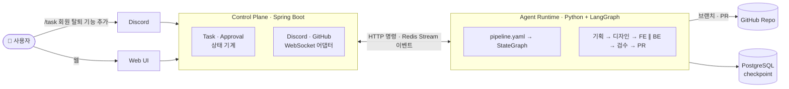

<div align="center">

<br/>

# 🧩 DevSquad

**당신이 정의한 AI 팀원들이 계획하고, 당신이 승인하면 일한다.**

*An approval-first AI dev team you assemble yourself — plan → approve → execute → approve, with Discord, GitHub and a live web UI.*

<br/>

[](https://github.com/jinho-yoo-jack/devsquad/actions/workflows/ci.yml)
[](LICENSE)
[](docs/16-구현-로드맵.md)
[](control-plane/)
[](agent-runtime/)
[](web/)
[](CONTRIBUTING.md)

<br/>

[왜 만드나](#-왜-만드나) · [어떻게 동작하나](#-어떻게-동작하나) · [팀원 정의하기](#-팀원-정의하기) · [빠른 시작](#-빠른-시작) · [문서](#-문서) · [로드맵](#-로드맵) · [기여](#-기여)

</div>

<br/>

## ✨ 왜 만드나

AI 코딩 도구에 "이거 해줘"라고 하면 코드가 바로 쏟아진다. 그런데 실제 개발은 그렇게 흐르지 않는다. **기획이 정해지고, 화면이 그려지고, API 계약이 합의된 뒤에** 구현이 시작된다. 지금의 도구는 이 순서를 건너뛰기 때문에 결과물이 요구와 어긋나거나, 잘못 가고 있을 때 사람이 멈춰 세울 지점이 없다.

DevSquad는 두 가지를 다르게 한다.

|  |  |
|---|---|
| 🧑‍💼 **역할이 있는 팀원** | 기획자·디자이너·백엔드·프론트엔드… 각 agent는 자기 페르소나, 작업 규약, 도메인 지식을 갖고 **자기 관점에서** 일한다. 팀 구성은 고정이 아니다 — 폴더 하나가 팀원 한 명이고, 당신이 팀을 짠다. |
| ✅ **승인 게이트** | 모든 팀원은 실행 전에 **"내가 할 일"을 계획으로 제출**하고, 사람이 승인해야 움직인다. 결과물도 다시 승인을 거쳐 다음 팀원에게 넘어간다. 사람은 실행자가 아니라 **리뷰어**가 된다. |
| 💬 **일하는 곳에서 결정** | 승인은 Discord 버튼으로도, 웹 UI로도 한다. 어디서 눌러도 같은 효과. 결과는 GitHub PR로 나온다. |
| 👀 **투명한 과정** | 웹 UI에서 어느 팀원이 지금 무엇을 생각하고, 어떤 도구를 호출했고, 무엇을 만들었는지 실시간 타임라인으로 본다. |
| 🔁 **내구성** | 승인을 며칠 기다려도, 서버가 재시작돼도 그 자리에서 이어진다. (LangGraph `interrupt()` + PostgreSQL checkpoint) |

<br/>

## ⚙️ 어떻게 동작하나



한 Task는 다음 순서로 흐른다. 각 Stage 안에서 **계획 승인**과 **결과 승인** 두 번 멈춘다.

```
명령 ─► 기획자: 계획 ✅ → 실행 → spec.md ✅
         └► 디자이너: 계획 ✅ → 실행 → 화면 설계 + 컴포넌트 트리 ✅
              ├► 백엔드:    계획 ✅ → 실행 → API 명세 + 코드 ✅ ─┐
              └► 프론트엔드: 계획 ✅ → 실행 → 코드 + API 사용 기록 ✅ ─┤  (병렬)
                                                                 └► 검수자: FE ↔ BE 계약 대조 ✅ ─► PR 생성
```

승인은 `approve` · `reject`(피드백 필수, 팀원이 반영해 재제출) · `edit`(직접 고쳐서 승인) 셋 중 하나다. 반려가 상한(기본 3회)을 넘으면 Task가 멈추고 사람을 부른다.

<details>
<summary><b>왜 Spring Boot + Python 두 서비스인가?</b></summary>
<br/>

LangGraph의 강점(`interrupt()`, checkpoint, super-step 병렬)은 Python 런타임 안에서만 의미가 있고, Discord·GitHub·WebSocket은 Spring 쪽 운영 도구가 갖춰져 있다. 둘을 한 프로세스에 넣으면 LLM 호출의 긴 지연이 Discord의 3초 응답 제한과 충돌한다. 그래서 **Control Plane**은 사람과 외부 시스템을 상대하며 Task/Approval의 진실을 갖고, **Agent Runtime**은 그래프를 실행하며 승인이 필요하면 `interrupt()`로 멈춰 이벤트만 낸다. 둘은 HTTP(명령)와 Redis Stream(이벤트)으로만 대화한다. 자세한 근거는 [11 시스템 아키텍처](docs/11-시스템-아키텍처.md).

</details>

<br/>

## 🧑‍🤝‍🧑 팀원 정의하기

팀원은 **당신의 저장소 안 폴더 하나**다. 서비스 DB가 아니라 코드 옆에 살기 때문에 PR로 리뷰되고, 프로젝트마다 다르게 둘 수 있고, DevSquad를 떠나도 남는다.

```
.devsquad/
├── spec.md                  # 프로젝트가 무엇인지 — 모든 팀원에게 주입
├── pipeline.yaml            # 조직도 — 누가 누구 다음에, 누구와 병렬로
└── agents/
    └── backend/             # ← 팀원 한 명
        ├── persona.md       #   누구인가: role · goal · backstory · 판단 기준
        ├── conventions.md   #   어떻게 일하나: 입력 · Plan 형식 · 규칙 · 결과물 형식 · 완료 기준 · 금지
        └── knowledge/       #   무엇을 아나: DB 스키마, API 가이드, 과거 결정 …
```

이름은 자유롭게 짓되, **도구 권한은 이름이 아니라 `tool_profile`로** 정해진다 (`docs-writer` · `code-writer` · `reader` · `publisher`). 팀원을 아무렇게 구성해도 보안 경계는 프로필이 지킨다.

바로 복사해 쓸 수 있는 예시 팀원 6종이 [`examples/devsquad-templates/`](examples/devsquad-templates/)에 있다.

| 팀원 | 프로필 | 남기는 것 |
|---|---|---|
| `planner` 기획자 | docs-writer | `docs/spec/*.md` — 유스케이스, 화면 목록, 데이터 항목 |
| `designer` 디자이너 | docs-writer | `docs/design/*.md` + `*.components.json` — 화면 설계, 컴포넌트 트리 |
| `backend` 백엔드 | code-writer | `docs/api/*.md`(OpenAPI 조각) + `server/**` 커밋 |
| `frontend` 프론트엔드 | code-writer | `web/**` 커밋 + `docs/api-usage/*.md` |
| `reviewer` 검수자 | reader | `docs/review/*.md` — FE↔BE 계약 불일치, 판정 |
| `qa` QA *(확장 예시)* | code-writer | `web/e2e/*.spec.ts` + `docs/qa/*.md` |

팀원을 빼려면 `pipeline.yaml`에서 Stage를 지우고, 추가하려면 폴더를 복사해 이름을 바꾸고 Stage를 넣으면 된다. 규격과 작성 원칙은 [17 Agent 정의 가이드](docs/17-Agent-정의-가이드.md).

<br/>

## 🚀 빠른 시작

> **현재 Phase 0 — 골격 단계.** 세 서비스가 기동하고 health check에 응답한다. 실제 파이프라인은 [Phase 1](docs/16-구현-로드맵.md)에서 들어온다.

**요구 사항** — Java 21 · Python 3.12 · Node 22 · Docker

```bash
git clone https://github.com/jinho-yoo-jack/devsquad.git && cd devsquad
cp infra/.env.example infra/.env                         # 값 채우기 (LLM 키 등)
docker compose -f infra/docker-compose.yml up -d postgres redis
```

세 서비스를 각각 띄운다.

```bash
# Control Plane  → http://localhost:8080/api/v1/health · /swagger-ui.html
cd control-plane && ./gradlew bootRun

# Agent Runtime  → http://localhost:8100/health
cd agent-runtime && python -m venv .venv && source .venv/bin/activate
pip install -e ".[dev]" && uvicorn app.main:app --port 8100 --reload

# Web            → http://localhost:3000
cd web && npm install && npm run dev
```

전부 컨테이너로 올리려면 `docker compose -f infra/docker-compose.yml --profile full up --build`.

<br/>

## 🗂️ 저장소 구조

```
devsquad/
├── control-plane/   Spring Boot 3.4 · Java 21   Task/Approval 상태 기계, Discord·GitHub·WebSocket 어댑터, Redis Stream consumer
├── agent-runtime/   FastAPI · LangGraph 1.x     pipeline.yaml → StateGraph, gate 노드(interrupt), 도구 샌드박스, 이벤트 발행
├── web/             Next.js 15 · React 19       Task 상세(파이프라인 · agent 카드 · 타임라인 · 승인 패널), 팀원 설정
├── infra/           docker-compose, .env.example
├── docs/            기획 · 설계 문서
└── examples/devsquad-templates/   .devsquad/ 팀원 템플릿
```

<br/>

## 📚 문서

설계는 코드보다 먼저 쓰였고, 구현은 이 문서를 계약으로 삼는다.

| 문서 | 내용 |
|---|---|
| [10 · PRD](docs/10-PRD.md) | 문제 정의, 기능·비기능 요구사항, Phase 범위 |
| [11 · 시스템 아키텍처](docs/11-시스템-아키텍처.md) | 서비스 경계, 프로토콜, 도메인 모델, 상태 기계 |
| [12 · 디자인](docs/12-디자인-화면-설계.md) | IA, 화면 설계, 컴포넌트, 디자인 토큰 |
| [13 · Frontend 설계](docs/13-Frontend-설계.md) | 상태 관리, WebSocket 재연결·replay |
| [14 · Backend 설계](docs/14-Backend-설계.md) | Spring 모듈·스키마, LangGraph 그래프·gate·샌드박스 |
| [15 · API · 이벤트 명세](docs/15-API-이벤트-명세.md) | REST, WebSocket, 이벤트 스키마, Discord 명령, `pipeline.yaml` |
| [16 · 구현 로드맵](docs/16-구현-로드맵.md) | Phase별 완료 기준과 작업 분해 |
| [17 · Agent 정의 가이드](docs/17-Agent-정의-가이드.md) | 팀원 규격, 프롬프트 조립, 결과물 공유 경로 |
| [02 · CrewAI vs LangGraph](docs/02-CrewAI-LangGraph-기술-정리.md) | 왜 LangGraph인가 |

<br/>

## 🗺️ 로드맵

- [x] **Phase 0 — 골격** · 세 서비스 기동, health check, CI
- [ ] **Phase 1 — 뼈대** · 기획 agent 1명, 계획/결과 승인 게이트, 웹 타임라인, 서버 재시작 후 재개
- [ ] **Phase 2 — 팀** · 디자인·FE·BE agent, FE ∥ BE 병렬, Discord 슬래시 명령·승인 카드, 팀원 설정 화면
- [ ] **Phase 3 — 결과물** · GitHub App, 브랜치 push, 상호 검수, PR 생성, 토큰 예산

각 Phase의 완료 기준(Definition of Done)과 작업 목록은 [16 구현 로드맵](docs/16-구현-로드맵.md)에 있다.

<br/>

## 🤝 기여

이슈와 PR을 환영한다. 브랜치·커밋 규칙은 [CONTRIBUTING.md](CONTRIBUTING.md)에 있다 — 짧게는: Conventional Commits, scope는 `cp` / `ar` / `web` / `infra` / `docs` / `templates`, 계약([15 명세](docs/15-API-이벤트-명세.md))을 바꾸는 PR은 문서와 코드를 함께 고친다.

## 📄 라이선스

[MIT](LICENSE) © 2026 jinho-yoo-jack
