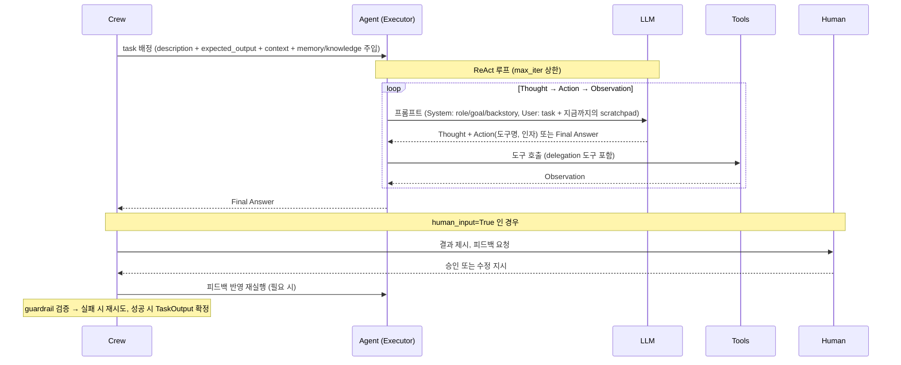
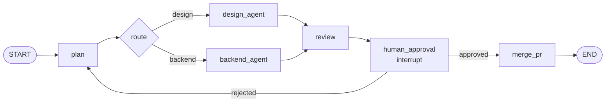

# CrewAI와 LangGraph — 멀티 에이전트 오케스트레이션 프레임워크 기술 정리

> [!tip] 핵심 Takeaway
> 두 프레임워크는 "여러 LLM agent를 어떻게 엮어 하나의 일을 시키는가"라는 같은 문제를 **정반대 방향**에서 푼다. CrewAI는 *역할(Role)을 가진 팀원*이라는 은유 위에서 agent·task를 선언하면 실행 루프를 프레임워크가 알아서 돌리는 **고수준(선언적) 프레임워크**이고, LangGraph는 *상태(State)를 공유하는 노드 그래프*를 직접 그리고 그 위에서 실행·중단·재개를 정밀하게 제어하는 **저수준(명시적) 런타임**이다. 이 프로젝트의 핵심 요구인 "각 agent가 할 일을 정의 → 사용자 승인 → 진행"은 CrewAI에서는 `human_input=True` 한 줄로, LangGraph에서는 `interrupt()` + checkpointer 조합으로 구현되며, 그 구현 깊이의 차이가 곧 두 프레임워크의 성격 차이다.

← [[00-프로젝트-개요]] · 이전 문서: [[01-배경-Gemini-대화-정리]]

조사 기준일 2026-09-11. CrewAI 최신 버전 1.15.21 (2026-09-09 릴리스, Python ≥3.10 <3.14), LangGraph 최신 버전 1.2.11 (2026-08-11 릴리스, Python ≥3.10). 두 프레임워크 모두 1.0 이후 안정 API를 유지하고 있다.

---

## 1. CrewAI란 무엇인가

### 1.1 정의와 설계 철학

CrewAI는 스스로를 "역할 연기(role-playing)를 하는 자율 AI agent들을 오케스트레이션하는 프레임워크"라고 정의한다. 핵심 은유는 **회사의 팀**이다. 사람이 팀을 꾸릴 때 "이 사람은 기획자, 이 사람은 백엔드 개발자"라고 역할을 정하고, 각자에게 업무(task)를 배정하고, 팀장이 순서를 잡거나 위임하는 것처럼, CrewAI에서는 `Agent`, `Task`, `Crew`, `Process`라는 네 가지 1급 개념으로 팀을 코드로 옮긴다.

설계 철학의 방향은 "개발자가 *무엇을* 원하는지만 선언하면 *어떻게* 실행할지는 프레임워크가 책임진다"이다. 그래서 agent 내부의 추론 루프(ReAct), 도구 호출, 재시도, 컨텍스트 윈도우 관리, agent 간 위임 프로토콜 같은 것들이 모두 프레임워크 안에 캡슐화되어 있다. 반대로 말하면 그 내부를 바꾸기는 어렵다.

초기 CrewAI는 LangChain 위에 얹힌 라이브러리였지만, 1.0 전후로 LangChain 의존을 걷어내고 독립 프레임워크가 되었다. 현재는 LLM 호출 계층, 도구 계층, 메모리 계층을 모두 자체 구현으로 갖고 있다.

### 1.2 핵심 구성 요소

#### Agent — 역할을 가진 실행 주체

`Agent`는 페르소나와 능력을 가진 하나의 LLM 실행 단위다. 세 가지 필수 속성이 페르소나를 만든다.

| 속성 | 의미 |
|---|---|
| `role` | 직무. 예: "Senior Backend Engineer" |
| `goal` | 이 agent가 의사결정할 때 기준으로 삼는 개별 목표 |
| `backstory` | 배경 서사. 전문 분야, 성향, 일하는 방식 |

이 세 값은 System Prompt로 합성되어 매 LLM 호출에 붙는다. 즉 CrewAI의 "페르소나"는 결국 구조화된 System Prompt 템플릿이다.

능력과 실행 제어를 위한 속성들이 그 위에 얹힌다.

- `llm` / `function_calling_llm` — 추론용 모델과 도구 호출용 모델을 분리할 수 있다. 비싼 모델은 추론, 싼 모델은 도구 인자 생성에 쓰는 식의 비용 최적화가 가능하다.
- `tools` — 이 agent가 쓸 수 있는 도구 목록. CrewAI 자체 `BaseTool`을 상속하거나 `@tool` 데코레이터로 만든다.
- `allow_delegation` — `True`면 프레임워크가 이 agent에게 *Delegate work to coworker*, *Ask question to coworker*라는 두 개의 내장 도구를 자동으로 주입한다. agent 간 협업은 결국 이 두 도구의 호출로 구현된다.
- `max_iter`(기본 20), `max_execution_time`, `max_retry_limit`(기본 2), `max_rpm` — 무한 루프·폭주 방지용 상한.
- `reasoning` / `max_reasoning_attempts` — task 실행 전에 계획을 먼저 세우는 단계를 켤 수 있다.
- `respect_context_window`(기본 True) — 컨텍스트 윈도우가 차면 자동으로 대화 이력을 요약한다.
- `knowledge_sources` — 파일·문자열·URL 등 도메인 지식을 붙이면 임베딩 후 RAG 방식으로 task 프롬프트에 주입된다. "각 agent에 CLAUDE.md·spec.md·도메인 지식을 심는다"는 요구가 정확히 이 속성에 대응한다.
- `step_callback` — agent가 한 스텝(생각 → 도구 호출 → 관찰)을 마칠 때마다 호출되는 훅. 웹 UI로 "일하는 모습"을 보여주려면 이 훅으로 이벤트를 밖으로 흘려야 한다.

agent는 Crew 없이도 `agent.kickoff("질문")`으로 단독 실행할 수 있다(`LiteAgentOutput` 반환).

#### Task — 배정되는 업무 단위

`Task`는 "무엇을 해서 어떤 결과를 내라"는 업무 명세다.

- `description`과 `expected_output`이 필수다. `expected_output`은 결과의 형태와 품질 기준을 자연어로 적는 것으로, 프롬프트에 그대로 포함되어 agent가 "언제 끝났는지"를 판단하는 기준이 된다.
- `agent` — 담당자. hierarchical process에서는 비워 두면 manager가 배정한다.
- `context: List[Task]` — 이 task가 참조할 선행 task 목록. 선행 task의 `TaskOutput`이 프롬프트의 컨텍스트 섹션으로 들어간다. sequential에서는 직전 task 출력이 자동으로 넘어가지만, 임의의 의존 관계를 만들려면 이 속성으로 명시한다.
- `output_pydantic` / `output_json` / `output_file` — 결과를 Pydantic 모델로 강제 파싱하거나 파일로 저장한다. 다음 agent가 기계적으로 읽을 수 있는 구조화된 산출물(API 명세 JSON 등)을 만들 때 쓴다.
- `async_execution` — 이 task를 비동기로 띄우고, 뒤에서 `context`로 참조하는 task가 결과를 기다린다.
- `human_input=True` — **agent가 결과를 낸 직후 실행을 멈추고 사람의 입력을 기다린다.** 사람이 피드백을 주면 agent가 그 피드백을 반영해 다시 결과를 낸다. 기본 구현은 콘솔 `input()`이라, Discord 승인으로 바꾸려면 이 지점을 커스텀해야 한다.
- `guardrail` / `guardrails` — `(TaskOutput) -> (bool, Any)` 시그니처의 검증 함수(또는 자연어 기준 문자열)를 체인으로 붙인다. 실패하면 오류 메시지를 agent에게 돌려주고 `guardrail_max_retries`(기본 3)까지 재시도한다. 결정적(deterministic) 검증을 LLM 루프 안에 끼워 넣는 장치다.
- `callback` — task 완료 후 훅.

결과는 `TaskOutput(raw, pydantic, json_dict, agent, description, summary, messages, ...)` 객체로 나온다.

#### Crew — 팀 그 자체

`Crew`는 agent 목록, task 목록, 그리고 실행 방식(`process`)을 묶는 컨테이너다. 주요 속성은 다음과 같다.

- `agents`, `tasks`, `process` — 필수 삼요소.
- `manager_llm` 또는 `manager_agent` — hierarchical process일 때 팀장 역할.
- `planning=True` + `planning_llm` — kickoff 전에 전체 task를 훑어 단계별 계획을 먼저 세우고 각 task 프롬프트에 붙인다.
- `memory=True` — 아래 1.4의 메모리 시스템 활성화.
- `knowledge_sources` — crew 공통 지식(agent 단위가 아닌 팀 단위).
- `cache`(기본 True) — 같은 인자의 도구 호출 결과를 캐시.
- `max_rpm` — 팀 전체의 분당 요청 상한.
- `step_callback`, `task_callback`, `before_kickoff` / `after_kickoff` 훅.
- `output_log_file` — JSON 또는 TXT로 실행 로그 저장.
- 스트리밍과 checkpointing(중단된 실행 재개) 옵션.

실행은 `kickoff(inputs={...})`가 기본이며, `inputs`의 키는 task·agent 문자열 안의 `{placeholder}`에 보간된다. 배치용 `kickoff_for_each`, 네이티브 async `akickoff`가 있다. 반환값 `CrewOutput`은 `raw`, `json_dict`, `pydantic`, `tasks_output`(각 task의 `TaskOutput`), `token_usage`를 담는다.

정의 방식은 세 가지다. 코드 인라인 인스턴스화, `@CrewBase` 클래스 안에 `@agent` / `@task` / `@crew` 데코레이터 메서드로 선언하고 YAML(`agents.yaml`, `tasks.yaml`)에서 페르소나 텍스트를 읽는 방식, 그리고 최근 권장되는 JSONC 설정 파일 방식이다. 페르소나 텍스트를 코드 밖 파일로 빼는 구조가 기본이라, 프롬프트 튜닝을 비개발자도 할 수 있게 하는 것이 의도다.

#### Process — 팀이 일하는 방식

`Process.sequential`은 task 목록 순서대로 하나씩 실행하고, 각 task의 출력이 다음 task의 컨텍스트로 이어지는 파이프라인이다. 예측 가능하고 비용이 낮다.

`Process.hierarchical`은 manager agent가 등장한다. manager는 task를 직접 수행하지 않고, agent들의 `role`·`goal`을 보고 **동적으로** 일을 배정하고, 결과를 검토하고, 부족하면 다시 시킨다. 사람 조직의 팀장을 흉내 낸 것이다. `manager_llm`만 주면 프레임워크가 기본 manager agent를 만들고, `manager_agent`를 주면 팀장의 페르소나를 직접 설계할 수 있다. manager의 검토·재배정 사이클 때문에 sequential보다 LLM 호출 수와 지연이 늘어난다.

문서상 process는 이 두 가지뿐이다(consensual은 예고만 있었고 구현되지 않았다).

### 1.3 실행 모델 — agent 내부에서 일어나는 일

CrewAI agent의 내부 루프는 **ReAct(Reason + Act)** 패턴이다. 한 task가 배정되면 다음이 반복된다.



여기서 중요한 구조적 사실 두 가지가 있다. 첫째, agent 간 소통은 별도 메시지 버스가 아니라 **도구 호출**이다. A가 B에게 위임하면 실제로는 A의 ReAct 루프 안에서 *Delegate work to coworker* 도구가 실행되고, 그 도구 구현이 B의 ReAct 루프를 동기적으로 돌려 결과 문자열을 A의 Observation으로 돌려준다. 즉 위임은 중첩 함수 호출이다. 둘째, 상태는 명시적 자료구조가 아니라 **프롬프트에 누적되는 텍스트(scratchpad)와 TaskOutput 체인**이다. 프레임워크가 어디까지 진행했는지를 외부에서 정확히 들여다보거나 임의 지점에서 되감기는 어렵다.

### 1.4 메모리와 지식

CrewAI의 메모리는 최근 대폭 개편되어, 과거의 short-term / long-term / entity / contextual 네 종류가 **단일 `Memory` 클래스**로 통합되었다. 저장은 LanceDB(기본 `./.crewai/memory`), 임베딩은 OpenAI `text-embedding-3-large`가 기본이며 Ollama·Hugging Face 등 로컬 임베더로 교체할 수 있다.

동작은 다음과 같다. 매 task가 끝나면 crew가 출력에서 개별 사실(fact)들을 LLM으로 추출해 저장하고, 다음 task 시작 전에 관련 기억을 recall해 프롬프트에 주입한다. 저장 시 LLM이 scope(`/project/decisions`처럼 파일시스템 같은 계층 경로), 카테고리, 중요도를 추론하고, 유사 기억이 있으면(cosine ≥ 0.85) keep / update / delete / insert를 판단해 중복을 막는다. recall은 의미 유사도 + 최근성 감쇠 + 중요도의 합성 점수로 순위를 매기며, shallow(벡터 검색만, ~200ms)와 deep(LLM이 질의 분석·scope 선택·재탐색) 모드가 있다. `source`와 `private` 플래그로 출처 추적과 가시성 제한이 가능하다.

메모리와 별개로 `knowledge_sources`는 정적 참조 자료(스펙 문서, 컨벤션, 스키마)를 임베딩해 두고 task마다 RAG로 꺼내 쓰는 계층이다. 정리하면 **knowledge는 사람이 준 고정 지식, memory는 실행 중 스스로 쌓는 경험**이다.

### 1.5 Flows — Crew 위의 오케스트레이션 계층

Crew만으로는 "조건 분기", "루프", "여러 crew를 순서대로 돌리기", "중간에 일반 Python 로직 끼우기" 같은 제어 흐름을 표현하기 어렵다. 이를 위해 CrewAI는 **Flow**를 별도 계층으로 제공한다.

Flow는 클래스 하나에 데코레이터 메서드들을 선언하는 이벤트 기반 모델이다.

- `@start()` — 진입점. 여러 개면 병렬 실행.
- `@listen(method)` — 지정한 메서드가 완료되면 트리거. `or_(a, b)`는 둘 중 하나, `and_(a, b)`는 둘 다 완료 시.
- `@router(method)` — 문자열 라벨을 반환하고, 그 라벨을 `@listen("label")`하는 메서드가 이어받는다. 조건 분기는 이렇게 만든다.
- `self.state` — flow 전체가 공유하는 상태. 딕셔너리(unstructured) 또는 Pydantic 모델(structured)로 선언한다. 각 실행에 UUID가 붙는다.
- `@persist` — 상태를 SQLite(기본)에 자동 저장. `kickoff(inputs={"id": uuid})`로 resume, `restore_from_state_id`로 fork.

Flow 메서드 안에서 `SomeCrew().crew().kickoff()`를 호출해 crew를 실행 단위로 쓰는 것이 의도된 사용법이다. 즉 **Flow = 오케스트레이션(제어 흐름·상태), Crew = 실행 단위(팀 작업)** 라는 2계층 구조다. 흥미롭게도 이 Flow 계층은 뒤에서 볼 LangGraph의 사고방식(명시적 상태 + 이벤트/조건 기반 전이 + 영속화)을 CrewAI 안으로 들여온 것이라 볼 수 있다.

---

## 2. LangGraph란 무엇인가

### 2.1 정의와 설계 철학

LangGraph는 LangChain 팀이 만든 "장기 실행되는 상태 기반(stateful) agent를 만들고 운영하기 위한 저수준 오케스트레이션 프레임워크이자 런타임"이다. 2025년 10월 1.0 GA에 도달했고, 현재 1.2.x 계열이다.

핵심 은유는 **상태 기계 / 데이터플로우 그래프**다. CrewAI가 "팀원"을 먼저 떠올리게 한다면, LangGraph는 "상태가 어떤 노드를 거쳐 어떻게 변해 가는가"를 먼저 그리게 한다. agent, 도구, 사람의 승인, 결정적 코드가 모두 똑같은 "노드"로 취급되고, 노드들은 하나의 공유 상태를 읽고 부분 갱신을 반환한다. LLM은 그래프의 특정 노드 안에서 호출되는 함수일 뿐이며, 프레임워크는 LLM이 무엇을 하는지에 관심이 없다.

설계 철학은 "프레임워크가 제어 흐름을 숨기지 않는다"이다. 그래서 프롬프트 템플릿도, ReAct 루프도, 위임 프로토콜도 기본 제공되지 않는다(prebuilt 모듈에 `create_react_agent` 같은 것이 있지만 이는 LangGraph 위에 만든 예시일 뿐이다). 대신 프레임워크가 책임지는 것은 **실행 시맨틱**이다: 어떤 순서로 노드가 돌고, 상태가 어떻게 합쳐지고, 어디서 멈추고, 어떻게 재개되고, 실패하면 어디서부터 다시 시작하는가.

### 2.2 핵심 구성 요소

#### State — 그래프 전체가 공유하는 자료구조

State는 `TypedDict` 또는 Pydantic `BaseModel`로 선언하는 스키마다. 그래프의 모든 노드는 이 State를 입력으로 받고, State의 **일부 키에 대한 갱신**을 반환한다.

```python
from typing import Annotated, TypedDict
from operator import add
from langgraph.graph.message import add_messages

class TeamState(TypedDict):
    messages: Annotated[list, add_messages]   # reducer: 메시지 누적
    spec: str                                  # 기본 reducer: 덮어쓰기
    artifacts: Annotated[list[str], add]       # reducer: 리스트 append
    approved: bool
```

여기서 **reducer**가 핵심 개념이다. 각 키마다 "현재 값과 노드가 낸 갱신을 어떻게 합칠지"를 정하는 함수가 붙는다. 기본은 덮어쓰기(right가 left를 대체)이고, `Annotated[list, add]`처럼 지정하면 append가 된다. 메시지 리스트에는 ID 기반 병합·역직렬화를 처리하는 `add_messages`를 쓴다. reducer가 있어야 **여러 노드가 같은 super-step에서 병렬로 같은 키를 갱신**해도 결정적으로 합쳐진다. `input_schema` / `output_schema`를 따로 두어 외부에 노출하는 키를 제한할 수 있고, 노드 간 내부 통신용 private state, 체크포인트에서 제외되는 `UntrackedValue`(DB 커넥션 등)도 있다.

#### Node — 상태를 받아 갱신을 반환하는 함수

노드는 그냥 Python 함수다. `(state, config, runtime)`을 받아 부분 갱신 dict를 반환한다. 안에서 LLM을 부르든, DB를 조회하든, 사람을 기다리든 프레임워크는 구분하지 않는다. 노드 함수는 `builder.add_node("name", fn)`으로 등록한다.

#### Edge — 다음에 어떤 노드를 실행할지 정하는 규칙

- **Normal edge**: `add_edge("a", "b")`. a가 끝나면 항상 b.
- **Conditional edge**: `add_conditional_edges("a", router_fn, {"label": "node", ...})`. router_fn이 state를 보고 다음 노드 이름(또는 매핑 키)을 반환한다. 분기·루프는 여기서 만든다.
- `START`, `END`는 예약된 가상 노드다.
- **`Send`**: conditional edge에서 `[Send("worker", {"item": x}) for x in items]`를 반환하면 항목 수만큼 같은 노드를 **동적으로 병렬 인스턴스화**한다. map-reduce 패턴이다.
- **`Command`**: 노드가 `Command(update={...}, goto="next")`를 반환하면 상태 갱신과 라우팅을 한 번에 한다. 도구 안에서도 반환할 수 있어서, "agent A의 도구가 B로 handoff"하는 멀티 에이전트 패턴의 기본 도구다. 같은 노드에서 normal edge와 Command 라우팅을 섞으면 안 된다.

#### Graph 컴파일

`builder.compile(checkpointer=..., store=..., interrupt_before=[...], interrupt_after=[...])`로 그래프 구조를 검증(고아 노드 등)하고 실행 가능한 객체를 만든다. 컴파일된 그래프는 `invoke`, `stream`, `ainvoke`, `astream`으로 실행한다. 서브그래프를 노드로 끼워 넣어 계층적 구성이 가능하다.

### 2.3 실행 모델 — Pregel과 super-step

LangGraph의 런타임은 Google의 대규모 그래프 처리 시스템 **Pregel**의 BSP(Bulk Synchronous Parallel) 모델을 따른다. 이것이 LangGraph를 "단순 DAG 실행기"와 구분 짓는 지점이다.

실행은 **super-step**이라는 라운드 단위로 진행된다. 한 super-step에서 "활성(active)" 상태인 모든 노드가 **병렬로** 실행되고, 각 노드가 반환한 갱신들이 reducer로 State에 병합된다. 그 갱신이 edge를 통해 다음 노드들에게 "메시지"로 전달되면 그 노드들이 다음 super-step에서 활성화된다. 메시지를 받지 못한 노드는 비활성(inactive)이다. 모든 노드가 비활성이고 전달 중인 메시지가 없으면 그래프가 종료된다. 순차 관계인 노드들은 서로 다른 super-step에 속하고, 독립적인 노드들은 같은 super-step에서 자연스럽게 병렬이 된다.



위 그래프에서 `design_agent`와 `backend_agent`는 같은 super-step에서 병렬 실행되고, 둘 다 `review`로 메시지를 보내면 `review`가 다음 super-step에서 한 번 실행된다(두 갱신은 reducer로 병합). `recursion_limit`(기본 1000 super-step)이 무한 루프 방지 상한이며, `RemainingSteps`로 남은 스텝을 노드 안에서 읽어 선제적으로 마무리할 수 있다.

super-step 경계는 곧 **체크포인트 경계**다. 매 super-step이 끝날 때 State 스냅샷이 저장된다. 이것이 다음 절의 영속성·중단·재개·되감기를 모두 가능하게 한다.

### 2.4 영속성(Persistence)과 durable execution

`compile(checkpointer=...)`로 체크포인터를 붙이면 매 super-step마다 State가 **thread** 단위로 저장된다. thread는 `config={"configurable": {"thread_id": "..."}}`로 지정하는 논리적 실행 스트림(대화 세션, 작업 티켓 등)이다.

체크포인터 구현은 `InMemorySaver`(개발용), `SqliteSaver`(로컬), `PostgresSaver` / `AsyncPostgresSaver`(운영용)가 공식 제공되고, 인터페이스를 구현하면 다른 저장소도 쓸 수 있다.

체크포인트가 있으면 다음이 가능하다.

- **재개(resume)**: 같은 thread_id로 `invoke(None, config)`하면 마지막 체크포인트 다음 super-step부터 이어 간다. 프로세스가 죽어도 상태는 DB에 있으니 "durable execution"이다.
- **상태 조회**: `get_state(config)` → `StateSnapshot(values, next, config, tasks, ...)`, `get_state_history(config)` → 전체 체크포인트 타임라인.
- **Time travel**: 과거 체크포인트의 `checkpoint_id`로 다시 실행하면 그 지점부터 **재실행**(replay)하고, `update_state(config, values)`로 과거 상태를 수정한 뒤 재실행하면 **분기**(fork)가 만들어진다. 디버깅과 "이 결정을 바꿨으면 어떻게 됐을까"에 쓴다.
- **Store**: 체크포인터는 thread 안에 갇힌 단기 기억이고, thread를 가로지르는 장기 기억(사용자 선호, 프로젝트 사실)은 별도의 `BaseStore`(InMemoryStore, PostgresStore)에 namespace 키로 저장한다. 노드는 `runtime.store`로 접근한다.

운영상 주의점으로 체크포인트 무한 증가(pruning 정책 필요), Postgres 컬럼 길이 제약, 서브그래프 간 상태 격리(공유가 필요하면 Store 사용) 등이 문서화되어 있다.

### 2.5 Human-in-the-loop — `interrupt()`와 `Command(resume=)`

LangGraph에서 사람의 승인은 별도 기능이 아니라 **영속성 위에 얹힌 제어 흐름**이다. 노드 안에서 `interrupt(payload)`를 호출하면 다음이 일어난다.

1. 런타임이 특수 예외를 던져 그 지점에서 실행을 멈추고, 현재 super-step까지의 State를 체크포인터에 저장한다.
2. 호출자에게 `payload`가 `result["__interrupt__"]`(또는 stream의 interrupt 이벤트)로 반환된다. 이 payload를 Discord 메시지, 웹 UI 카드 등 어디로든 보낼 수 있다.
3. 그래프는 **무기한** 기다린다. 프로세스가 내려가도 상관없다.
4. 사람이 답하면 `graph.invoke(Command(resume=값), config)`로 재개한다. `resume`으로 넘긴 값이 노드 안에서 `interrupt()`의 **반환값**이 된다.

여기에 반드시 알아야 할 시맨틱이 하나 있다. 재개 시 런타임은 **노드를 처음부터 다시 실행**한다. `interrupt()`가 있던 줄에서 이어 가는 것이 아니다. 따라서 `interrupt()` 앞에 있는 코드는 두 번 실행되며, 부작용이 있는 코드(외부 API 호출, DB 쓰기)는 멱등해야 하거나 `interrupt()` 뒤로 옮겨야 한다. 한 노드에 `interrupt()`가 여럿이면 호출 순서가 결정적이어야 하고(resume 값은 인덱스로 매칭), `while True` 안에 `interrupt()`를 두면 재실행이 지수적으로 늘어나므로 대신 conditional edge로 루프를 만들어야 한다. `interrupt()`를 bare `try/except`로 감싸면 제어 예외를 잡아먹어 동작이 깨진다.

전형적인 패턴은 세 가지다. **승인/반려**: `decision = interrupt({"plan": plan})` 후 `Command(goto="proceed" if decision == "approve" else "revise")`. **검토 후 수정**: 생성물을 payload로 보내고, 사람이 편집한 버전을 resume 값으로 받아 State에 반영. **도구 실행 전 승인**: 도구 함수 안에서 `interrupt()`를 호출해 위험한 도구(PR 머지, 배포)가 실제로 실행되기 전에 사람이 확인. 병렬 노드가 동시에 interrupt하면 `Command(resume={interrupt_id: 값, ...})`로 각각 답한다.

`compile(interrupt_before=["node"])` / `interrupt_after` 같은 정적 브레이크포인트도 있지만, 노드 안에서 조건부로 멈추고 payload를 실어 보낼 수 있는 동적 `interrupt()`가 현재 권장 방식이다.

### 2.6 스트리밍, 서브그래프, 관측

`stream(..., stream_mode=...)`는 `values`(매 super-step 후 전체 State), `updates`(노드별 갱신만), `messages`(LLM 토큰 단위), `custom`(노드가 `get_stream_writer()`로 직접 밀어 넣는 임의 이벤트), `debug` 모드를 지원하며 여러 모드를 동시에 구독할 수 있다. 웹 UI에서 "지금 어느 노드가 무엇을 하고 있는지"를 실시간으로 그리는 데이터 소스가 바로 이 스트림이다. 서브그래프는 컴파일된 그래프를 상위 그래프의 노드로 등록하는 것으로, 팀원 agent 하나를 독립 그래프로 만들고 상위 오케스트레이터 그래프에 끼우는 계층 구조를 만든다. 관측은 LangSmith와 통합되어 있으나 필수는 아니다.

### 2.7 멀티 에이전트 아키텍처 패턴

LangGraph는 "멀티 에이전트 방식"을 강제하지 않고, 공식 문서가 다섯 가지 패턴을 제시한다.

| 패턴 | 구조 | 특성 |
|---|---|---|
| Subagents (Supervisor) | 상위 agent가 하위 agent들을 **도구**처럼 호출. 모든 라우팅이 상위를 거침 | 병렬 실행 용이, 통제 집중. 한 요청에 모델 호출 1회 더 필요 |
| Handoffs (Swarm) | agent가 도구 호출로 `Command(goto=other_agent)`를 반환해 **제어권을 직접 넘김** | 상태 유지로 반복 요청 시 호출 40~50% 절감. 통제 분산 |
| Router | 앞단 LLM이 분류 → 해당 agent 실행 → 결과 합성 | 다도메인 병렬에 효율적 |
| Skills | agent 하나가 필요할 때 전문 컨텍스트를 로드 | 대화 연속성 유지, 컨텍스트 비용 누적 |
| Custom workflow | 결정적 코드와 agent 노드를 그래프로 자유 조합 | 가장 유연, 가장 많이 직접 써야 함 |

"기획 → 디자인 → 프론트/백엔드 → 리뷰 → 승인"처럼 단계가 정해진 개발 파이프라인은 Custom workflow(결정적 단계 전이) 안에 각 단계를 Subagent 서브그래프로 넣는 조합이 자연스럽다.

---

## 3. 두 프레임워크의 비교

### 3.1 추상화 수준과 통제권

가장 근본적인 차이는 **누가 제어 흐름을 소유하는가**다. CrewAI는 프레임워크가 소유한다. 개발자는 팀원과 업무를 선언하고, 순차인지 계층인지 고르면 끝이다. LangGraph는 개발자가 소유한다. 어느 노드에서 어느 노드로 갈지, 상태가 어떻게 합쳐질지, 어디서 멈출지를 전부 직접 쓴다. CrewAI Flows가 이 격차를 어느 정도 메우지만, Flow 안의 Crew 내부(ReAct 루프, 위임)는 여전히 블랙박스다.

### 3.2 상태 모델

CrewAI Crew의 상태는 프롬프트에 누적되는 텍스트와 `TaskOutput` 체인이다(Flow 계층에는 `self.state`가 있다). LangGraph의 상태는 스키마와 reducer가 명시된 자료구조이고, 매 super-step마다 스냅샷된다. 따라서 "지금 정확히 어디까지 갔고 무엇이 결정되었는가"를 외부에서 조회·수정·되감기하는 능력은 LangGraph가 압도적이다. 웹 UI로 진행 상태를 보이고, 사용자가 중간 산출물을 편집해 다시 돌리는 요구에는 이 차이가 직접 영향을 준다.

### 3.3 Human-in-the-loop

CrewAI의 `human_input=True`는 task 완료 직후 한 지점에서 콘솔 입력을 받는 고정된 게이트다. Discord 승인으로 바꾸려면 입력 훅을 오버라이드해야 하고, "며칠 뒤 승인"처럼 프로세스가 내려간 사이의 대기는 Flow의 `@persist`와 조합해야 겨우 가능하다. LangGraph의 `interrupt()`는 어느 노드 어느 지점에서든, 임의의 payload를 실어, 프로세스 재시작을 넘어 무기한 대기하고, 재개 값으로 분기까지 할 수 있다. 다만 "노드 재실행" 시맨틱과 멱등성을 개발자가 책임져야 한다.

### 3.4 agent 간 소통

CrewAI는 위임 도구(동기 중첩 호출)와 task context 전달이 소통 수단이며, hierarchical process가 팀장 모델을 기본 제공한다. LangGraph는 공유 State와 `Command`/`Send`가 소통 수단이고, supervisor·handoff 등 패턴을 직접 조립한다. "팀장이 알아서 배정하고 검토한다"를 빨리 보고 싶다면 CrewAI, 배정 규칙을 결정적으로 통제하고 싶다면 LangGraph다.

### 3.5 메모리·지식

CrewAI는 LLM이 scope·중요도·중복까지 판단하는 통합 `Memory`와 `knowledge_sources`(RAG)를 내장한다. LangGraph는 thread 단기 기억(checkpointer)과 cross-thread 장기 기억(Store)의 **저장 인프라**만 제공하고, 무엇을 언제 기억할지는 개발자가 노드에 써야 한다.

### 3.6 병렬성

CrewAI는 `async_execution` task와 Flow의 병렬 `@start`로 제한적 병렬이 가능하다. LangGraph는 BSP 모델 덕분에 독립 노드가 자동 병렬이며 `Send`로 동적 fan-out까지 된다.

### 3.7 학습 곡선과 산출 속도

CrewAI는 첫 동작하는 팀을 수십 줄로 만들 수 있고, 페르소나를 YAML로 빼 두어 비개발자 협업에도 유리하다. LangGraph는 State 설계, reducer, 그래프 배선, checkpointer 운영을 다 알아야 첫 결과가 나온다. 대신 그 뒤에 "왜 이렇게 동작했는가"를 추적하기가 쉽다.

### 3.8 요약표

| 관점 | CrewAI | LangGraph |
|---|---|---|
| 핵심 은유 | 역할을 가진 팀 | 상태 기계 그래프 |
| 추상화 | 고수준·선언적 | 저수준·명시적 |
| 1급 개념 | Agent, Task, Crew, Process, Flow | State, Node, Edge, Graph, Checkpointer |
| 실행 모델 | agent별 ReAct 루프, task 순차/계층 | Pregel BSP super-step, 자동 병렬 |
| 상태 | 프롬프트 누적 + TaskOutput 체인 (Flow: `self.state`) | 스키마 + reducer, super-step마다 스냅샷 |
| HITL | `human_input=True` (task 단위 고정 게이트) | `interrupt()` + `Command(resume=)` (임의 지점, 무기한) |
| 영속·재개 | Crew checkpointing, Flow `@persist`(SQLite) | checkpointer(Memory/Sqlite/Postgres), time travel |
| agent 간 소통 | 위임 도구, task context | 공유 State, `Command`, `Send` |
| 메모리 | 통합 `Memory`(LanceDB) + knowledge RAG 내장 | checkpointer + Store 인프라만 제공 |
| 관측 | step/task callback, 로그 파일 | 다중 stream_mode, LangSmith |
| 강점 | 빠른 프로토타입, 직관적 팀 모델 | 정밀 통제, 내구성, 디버깅 가능성 |
| 약점 | 내부 블랙박스, HITL 유연성 부족 | 초기 학습·설계 비용 |

---

## 4. 이 프로젝트 관점의 시사점

이 프로젝트의 요구를 네 가지로 쪼개면 프레임워크 적합도가 드러난다.

첫째, "각 팀원 agent에 `CLAUDE.md`·`spec.md`·도메인 지식을 심는다"는 두 프레임워크 모두 잘 한다. CrewAI는 `role/goal/backstory` + `knowledge_sources`가 그 자리이고, LangGraph는 각 agent 노드(또는 서브그래프)의 System Prompt 구성 코드가 그 자리다. 차이는 CrewAI가 자리를 마련해 주고 LangGraph는 직접 만든다는 것뿐이다.

둘째, "할 일을 정의하고 허락을 맡고 진행한다"는 승인 게이트가 **Discord에서, 비동기로, 시간이 얼마나 걸리든** 동작해야 한다. 이 요구는 LangGraph의 `interrupt()` + Postgres checkpointer가 정확히 겨냥하는 지점이다. CrewAI로 하려면 `human_input` 훅을 Discord로 재배선하고 Flow `@persist`로 대기 상태를 보존해야 해서, 프레임워크의 편의를 상당 부분 포기하게 된다.

셋째, "웹 UI로 일하는 모습을 본다"는 실행 이벤트를 밖으로 흘리는 능력이다. LangGraph는 `stream_mode=["updates","messages","custom"]`으로 노드 단위·토큰 단위 이벤트가 나오고 `get_state_history`로 과거도 볼 수 있다. CrewAI는 `step_callback`/`task_callback`으로 가능하지만 이벤트 입도가 프레임워크가 정한 대로 고정된다.

넷째, "Discord/GitHub 연동"은 프레임워크와 무관한 도구 계층이라 어느 쪽이든 같다.

정리하면, **빠르게 팀이 돌아가는 모습을 보고 싶다면 CrewAI**, **승인·재개·관측을 서비스 품질로 끌어올리고 싶다면 LangGraph**다. 절충안으로 "각 팀원 agent의 내부는 CrewAI Agent(또는 Claude Agent SDK)로 만들고, 팀 전체의 단계 전이·승인·영속은 LangGraph 그래프가 맡는" 2계층 구성도 가능하다. CrewAI Flows가 바로 그 절충을 CrewAI 안에서 시도한 것이므로, Flow가 충분한지 먼저 시험해 보고 부족하면 LangGraph로 오케스트레이션 계층을 옮기는 순서가 비용이 가장 낮다.

한 가지 더. 두 프레임워크 모두 Python 생태계다. 주력 스택이 Java/Spring이라면, 오케스트레이션 서비스를 Python으로 따로 두고 Discord 봇·GitHub 웹훅·웹 UI 백엔드를 Spring으로 두는 폴리글랏 구성이 될 가능성이 크다. 이 경계를 어디에 둘지가 다음 설계 문서의 주제가 될 것이다.

---

## 참고 자료

- CrewAI 공식 문서 — [Crews](https://docs.crewai.com/en/concepts/crews), [Agents](https://docs.crewai.com/en/concepts/agents), [Tasks](https://docs.crewai.com/en/concepts/tasks), [Processes](https://docs.crewai.com/en/concepts/processes), [Memory](https://docs.crewai.com/en/concepts/memory), [Flows](https://docs.crewai.com/en/concepts/flows), [Changelog](https://docs.crewai.com/en/changelog)
- [crewai · PyPI](https://pypi.org/project/crewai/) (1.15.21, 2026-09-09)
- LangGraph 공식 문서 — [Overview](https://docs.langchain.com/oss/python/langgraph/overview), [Graph API](https://docs.langchain.com/oss/python/langgraph/graph-api), [Persistence](https://docs.langchain.com/oss/python/langgraph/persistence), [Interrupts](https://docs.langchain.com/oss/python/langgraph/interrupts), [Multi-agent](https://docs.langchain.com/oss/python/langchain/multi-agent)
- [langgraph · PyPI](https://pypi.org/project/langgraph/) (1.2.11, 2026-08-11)
- [LangChain and LangGraph Agent Frameworks Reach v1.0 Milestones](https://www.langchain.com/blog/langchain-langgraph-1dot0)
