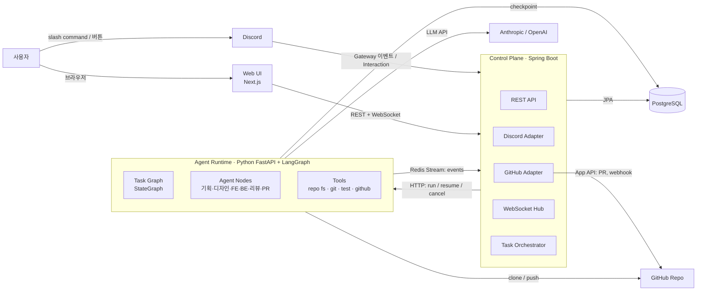
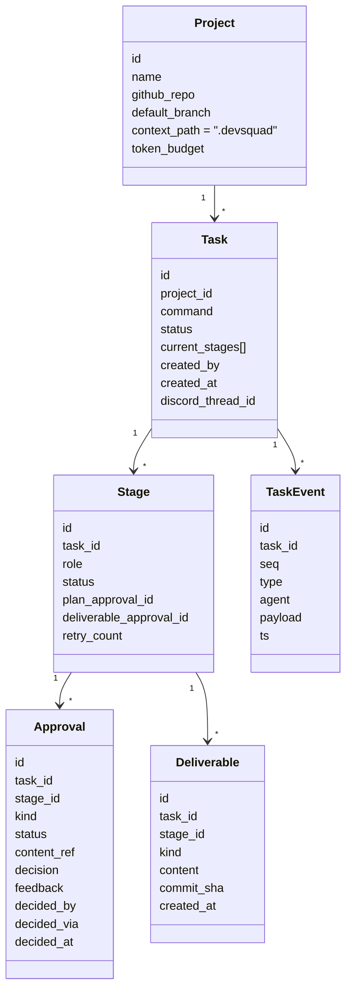
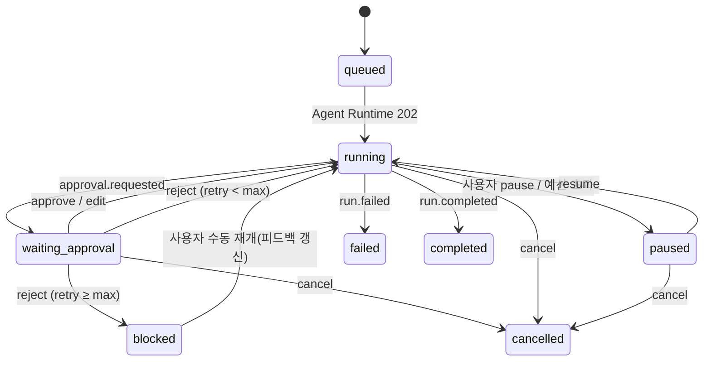
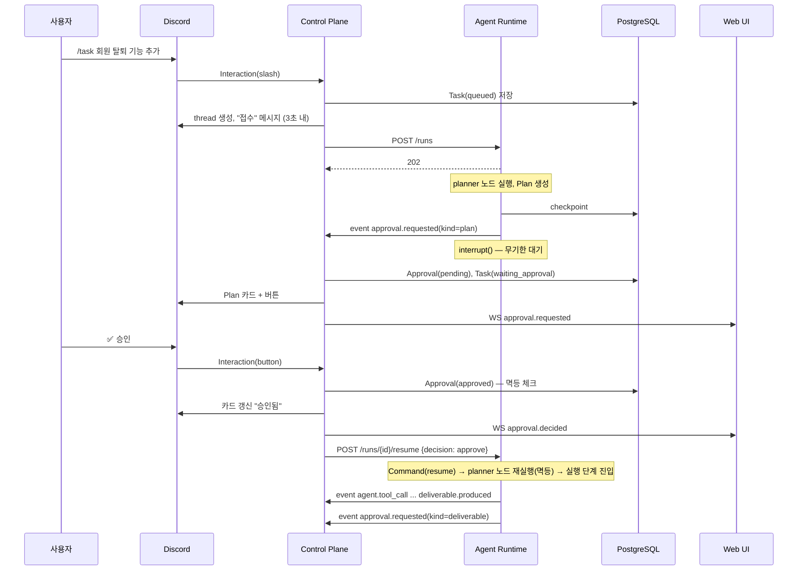

# 시스템 아키텍처와 도메인 모델

> [!tip] 핵심 Takeaway
> 시스템은 **Spring Boot "Control Plane"** 과 **Python "Agent Runtime"** 두 서비스로 나눈다. Control Plane이 사용자·Discord·GitHub·웹 UI를 상대하며 Task와 Approval의 진실(source of truth)을 갖고, Agent Runtime은 LangGraph 그래프를 실행하며 `interrupt()`로 멈춰 승인을 기다린다. 둘은 HTTP(명령)와 Redis Stream(이벤트)으로만 대화하며, 어느 쪽이 죽어도 PostgreSQL의 체크포인트와 Task 레코드로 복구된다.

← [[10-PRD]] · 다음: [[12-디자인-화면-설계]]

## 1. 컨텍스트 다이어그램



## 2. 서비스 경계와 책임

### 2.1 Control Plane (Spring Boot 3.x, Java 21)

사람과 외부 시스템을 상대하는 모든 것을 맡는다. 구체적으로 Task 생명주기 관리(생성, 상태 전이, 취소), Approval 레코드 관리와 멱등 처리, Discord Gateway 연결·slash command·버튼 인터랙션 처리, GitHub App 인증·PR 생성·webhook 수신, 웹 UI용 REST API와 WebSocket 이벤트 팬아웃, Agent Runtime에서 오는 이벤트 소비·저장·재전송, 토큰 예산 집계와 상한 강제를 담당한다.

Control Plane은 **LLM을 호출하지 않는다.** agent 추론과 도구 실행은 전부 Agent Runtime에 있다.

### 2.2 Agent Runtime (Python 3.12, FastAPI + LangGraph 1.2)

LangGraph `StateGraph` 하나(Task Graph)를 정의하고 실행한다. Control Plane의 명령에 따라 `graph.invoke` / `graph.invoke(Command(resume=...))`를 thread_id = task_id로 호출하며, 실행 중 발생하는 노드 갱신·LLM 토큰·도구 호출·interrupt를 이벤트로 Redis Stream에 발행한다. `PostgresSaver`로 체크포인트를 저장하고, 각 agent 노드의 System Prompt를 Project 저장소의 `.devsquad/` 파일에서 조립한다. 도구(파일 시스템, git, 테스트 실행, GitHub)는 역할별 화이트리스트로 노출한다.

Agent Runtime은 **사용자를 직접 상대하지 않는다.** Discord도 웹소켓도 모른다. 승인이 필요하면 `interrupt(payload)`로 멈추고 `approval.requested` 이벤트를 낼 뿐이다.

### 2.3 왜 이렇게 나누는가

LangGraph의 강점(interrupt, checkpoint, super-step 병렬)은 Python 런타임 안에서만 의미가 있고, Discord/GitHub/웹소켓 처리는 Spring이 더 익숙하고 운영 도구가 갖춰져 있다. 두 관심사를 한 프로세스에 넣으면 LLM 호출의 긴 지연이 Discord 인터랙션 3초 응답 제한과 충돌한다. 경계를 "명령은 HTTP, 사실은 이벤트"로 얇게 유지하면 나중에 Agent Runtime을 Claude Agent SDK 기반으로 교체하거나 여러 인스턴스로 늘리는 일이 Control Plane에 영향을 주지 않는다.

## 3. 서비스 간 프로토콜

### 3.1 명령 (Control Plane → Agent Runtime, HTTP)

| 메서드 | 경로 | 의미 |
|---|---|---|
| POST | `/runs` | `{task_id, project_ref, command, config}` → 그래프 시작. 즉시 202 반환, 실행은 백그라운드 |
| POST | `/runs/{task_id}/resume` | `{approval_id, decision, feedback?, edited_content?}` → `Command(resume=...)`로 재개 |
| POST | `/runs/{task_id}/continue` | 재개 값 없이 마지막 체크포인트에서 이어 실행 (`invoke(None)`). 런타임 재시작 복구용 |
| POST | `/runs/{task_id}/cancel` | 실행 중이면 중단, 대기 중이면 thread 종료 마킹 |
| GET | `/runs/{task_id}/state` | `get_state` 스냅샷(디버그·복구용) |
| GET | `/health` | 헬스 체크 |

Agent Runtime은 stateless HTTP 서버처럼 동작하되, 실행 중인 그래프는 프로세스 내 asyncio task로 돈다. 프로세스가 죽으면 Control Plane이 `state`를 조회해 `next`가 비어 있지 않으면 `resume` 없이 `invoke(None)`으로 이어 가게 하는 복구 절차를 갖는다.

### 3.2 이벤트 (Agent Runtime → Control Plane, Redis Stream `devsquad:events`)

모든 이벤트는 공통 envelope를 가진다.

```json
{
  "event_id": "uuid",
  "task_id": "uuid",
  "stage": "planning | design | frontend | backend | review | pr",
  "agent": "planner | designer | frontend | backend | reviewer | publisher | system",
  "type": "…",
  "ts": "2026-09-11T10:00:00Z",
  "seq": 1234,
  "payload": { }
}
```

이벤트 타입은 다음으로 한정한다.

| type | payload | 용도 |
|---|---|---|
| `stage.started` / `stage.completed` | `{stage}` | 파이프라인 시각화 |
| `agent.thinking` | `{summary}` | agent 카드의 "지금 생각" (LLM 출력 중 reasoning 요약, 토큰 스트림은 보내지 않음) |
| `agent.tool_call` | `{tool, args_summary}` | 타임라인 |
| `agent.tool_result` | `{tool, ok, summary}` | 타임라인 |
| `agent.message` | `{text}` | agent가 사람에게 남기는 설명 |
| `approval.requested` | `{approval_id, kind: plan\|deliverable, title, content_ref, retry_no}` | 승인 카드 생성 트리거 |
| `deliverable.produced` | `{deliverable_id, kind, uri, summary}` | 산출물 뷰어 |
| `usage` | `{model, input_tokens, output_tokens}` | 비용 집계 |
| `run.paused` / `run.resumed` / `run.failed` / `run.completed` | `{reason?}` | Task 상태 전이 |

Control Plane은 consumer group으로 읽어 `task_event` 테이블에 append하고, WebSocket 구독자에게 팬아웃하고, `approval.requested`에는 Approval 레코드를 만들어 Discord 카드를 올린다. `seq`는 thread 내 단조 증가라 클라이언트가 누락·재정렬을 감지할 수 있다.

### 3.3 산출물 저장

Deliverable 본문(Markdown, JSON, diff)은 이벤트에 싣지 않고 **object storage(MinIO/S3) 또는 Postgres large text**에 저장하고 `uri`만 넘긴다. MVP는 Postgres `deliverable.content` 컬럼(text)으로 시작하고, 크기가 문제되면 S3로 옮긴다. 코드 산출물은 git 브랜치 자체가 저장소이고 Deliverable에는 커밋 SHA와 diff 요약만 둔다.

## 4. 도메인 모델



## 5. 상태 기계

### 5.1 Task 상태



### 5.2 Stage 상태

`pending → planning → plan_review → executing → deliverable_review → approved` 의 정방향에, `plan_review`와 `deliverable_review`에서 reject 시 각각 `planning`, `executing`으로 되돌아가는 루프가 있다. FE·BE Stage는 동시에 `executing`일 수 있으며 Task의 `current_stages`는 배열이다.

### 5.3 Approval 상태

`pending → approved | rejected | edited`. 결정은 한 번만 가능하고(DB unique + 낙관적 락), 이후 요청은 409로 거절하되 Discord/웹에는 "이미 처리됨"으로 표시한다.

## 6. 핵심 시퀀스

### 6.1 명령 → 계획 승인 → 실행



### 6.2 프로세스 재시작 복구

Control Plane이 기동하면 `status in (running, waiting_approval)`인 Task를 조회해 각각 Agent Runtime의 `GET /runs/{id}/state`를 호출한다. `next`가 비어 있고 `interrupts`가 있으면 대기 상태가 정상 유지된 것이므로 아무것도 하지 않는다. `next`가 있는데 실행 중인 asyncio task가 없으면(런타임이 죽었던 경우) `POST /runs/{id}/resume` 없이 `invoke(None)`을 요청하는 `POST /runs/{id}/continue`를 호출해 마지막 체크포인트에서 이어 간다.

## 7. Project 컨텍스트 파일 구조

agent를 정의하는 파일은 대상 저장소 안에 산다. 코드와 같은 PR 흐름으로 관리되고, 프로젝트마다 다르게 둘 수 있다.

```
.devsquad/
├── spec.md                  # 공통: 프로젝트가 무엇인지 (모든 agent 주입)
├── pipeline.yaml            # Stage 순서·병렬 그룹·승인 정책·retry 상한
└── agents/
    ├── planner/
    │   ├── persona.md       # role / goal / backstory
    │   ├── conventions.md   # 행동 규칙 (PRD 템플릿, 문서 위치, 금지 사항)
    │   └── knowledge/       # 기획 방법론, 기존 spec 문서 등
    ├── designer/
    │   ├── persona.md
    │   ├── conventions.md   # 디자인 토큰, 컴포넌트 명명, 산출물 형식
    │   └── knowledge/
    ├── frontend/
    │   ├── persona.md
    │   ├── conventions.md   # 코딩 컨벤션, 디렉토리 구조, 테스트 의무
    │   └── knowledge/
    ├── backend/
    │   ├── persona.md
    │   ├── conventions.md
    │   └── knowledge/       # DB 스키마, API 가이드, 보안 규정
    └── reviewer/
        ├── persona.md
        └── conventions.md   # 상호 검수 체크리스트
```

`pipeline.yaml` 예시:

```yaml
version: 1
stages:
  - id: planning
    agent: planner
    approvals: [plan, deliverable]
  - id: design
    agent: designer
    depends_on: [planning]
    approvals: [plan, deliverable]
  - id: frontend
    agent: frontend
    depends_on: [design]
    approvals: [plan, deliverable]
  - id: backend
    agent: backend
    depends_on: [design]
    approvals: [plan, deliverable]
  - id: review
    agent: reviewer
    depends_on: [frontend, backend]
    approvals: [deliverable]
  - id: pr
    agent: publisher
    depends_on: [review]
    approvals: []           # review 승인이 곧 PR 승인
policy:
  max_retries_per_approval: 3
  token_budget: 2_000_000
```

Agent Runtime은 이 파일을 읽어 그래프를 **동적으로 조립**한다. `depends_on`이 같은 Stage들은 같은 super-step에서 병렬 실행된다(LangGraph BSP). MVP Phase 1은 `stages`에 planning만 있는 `pipeline.yaml`로 시작한다.

## 8. 인프라 구성 (MVP)

Docker Compose 한 파일로 `control-plane`(Spring), `agent-runtime`(Python), `web`(Next.js), `postgres`, `redis`를 띄운다. Postgres에는 Control Plane 스키마(`public`)와 LangGraph 체크포인트 스키마(`langgraph`)를 분리한다. Secret은 `.env.example`만 커밋하고 실제 값은 로컬 `.env` 또는 Secret Manager에서 주입한다. 웹은 Control Plane REST를 same-origin 프록시로 호출한다.

## 9. 트레이드오프 기록

Redis Stream 대신 Postgres LISTEN/NOTIFY나 Agent Runtime → Control Plane HTTP 콜백을 쓸 수도 있었다. Stream을 택한 이유는 consumer group으로 Control Plane 다중 인스턴스에 안전하게 분배되고, 이벤트가 유실되지 않고, Control Plane이 잠시 죽어도 이벤트가 쌓여 있다가 처리되기 때문이다. 대가는 Redis라는 인프라가 하나 늘어나는 것이다. Phase 1에서 부담이면 HTTP 콜백으로 시작하고 인터페이스(`EventPublisher`)만 유지해 나중에 갈아 끼운다.
