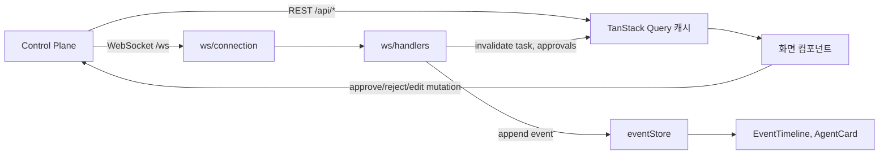

# Frontend 설계 — Next.js 웹 UI

> [!tip] 핵심 Takeaway
> 웹 UI는 **서버 상태(Task·Approval·Deliverable)는 TanStack Query로, 실시간 이벤트 스트림은 WebSocket → Zustand 스토어로** 나눠 다룬다. WebSocket 이벤트는 캐시를 직접 덮어쓰지 않고 "무효화 신호 + 타임라인 append"로만 쓴다. 그래야 연결이 끊기고 다시 붙어도 `seq` 기준으로 빠진 구간을 REST로 채우는 복구가 단순해진다.

← [[12-디자인-화면-설계]] · 다음: [[14-Backend-설계]]

## 1. 기술 스택

| 영역 | 선택 | 이유 |
|---|---|---|
| 프레임워크 | Next.js 15 (App Router), React 19, TypeScript | 라우팅·SSR·API 프록시를 한 번에. 팀원 FE agent의 대상 스택과 일치시켜 conventions 재사용 |
| 스타일 | Tailwind CSS 4 + CSS 변수 토큰 | 12-디자인 문서의 토큰을 그대로 변수로 |
| 컴포넌트 | shadcn/ui (Radix 기반) | 접근성 갖춘 primitive, 소스 소유 |
| 서버 상태 | TanStack Query 5 | 캐시·무효화·낙관적 업데이트 |
| 클라이언트 상태 | Zustand | 이벤트 스트림, WS 연결 상태, UI 필터 |
| 실시간 | native WebSocket + 재연결 래퍼 | STOMP 불필요. 서버는 Spring WebSocket(raw) |
| Markdown | react-markdown + remark-gfm + rehype-highlight | Plan·Deliverable 렌더 |
| Diff | `react-diff-viewer-continued` 또는 Monaco diff | 코드 산출물 |
| 편집기 | CodeMirror 6 (Markdown 모드) | edit 승인, Agent 설정 |
| 가상 스크롤 | `@tanstack/react-virtual` | 타임라인 수천 건 |
| 폼·검증 | react-hook-form + zod | 새 Task, 반려 피드백 |
| 테스트 | Vitest + Testing Library, Playwright(E2E) | |

## 2. 디렉토리 구조

```
web/
├── app/
│   ├── layout.tsx                 # 헤더, 테마, QueryClientProvider, WS bootstrap
│   ├── page.tsx                   # → /tasks
│   ├── tasks/
│   │   ├── page.tsx               # 목록
│   │   ├── new/page.tsx
│   │   └── [id]/
│   │       ├── page.tsx           # 상세 (3구역)
│   │       └── deliverables/[did]/page.tsx
│   ├── projects/
│   │   ├── page.tsx
│   │   └── [id]/agents/page.tsx
│   ├── settings/page.tsx
│   └── api/[...path]/route.ts     # Control Plane REST 프록시 (same-origin)
├── components/
│   ├── pipeline/PipelineBar.tsx
│   ├── agents/AgentCard.tsx
│   ├── timeline/{EventTimeline,EventRow,ToolCallPair}.tsx
│   ├── approval/{ApprovalPanel,RejectForm,EditForm,ApprovalHistory}.tsx
│   ├── viewer/{MarkdownView,DiffView,JsonTree,DeliverableTabs}.tsx
│   ├── editor/MarkdownEditor.tsx
│   ├── common/{StatusBadge,TokenMeter,ConnectionIndicator,EmptyState}.tsx
│   └── ui/                        # shadcn 생성물
├── lib/
│   ├── api/                       # fetch 래퍼 + 타입 (OpenAPI 생성)
│   │   ├── client.ts
│   │   └── generated/             # openapi-typescript 출력
│   ├── ws/
│   │   ├── connection.ts          # 재연결·heartbeat·구독 관리
│   │   └── handlers.ts            # 이벤트 → 스토어/쿼리 무효화 매핑
│   ├── stores/
│   │   ├── eventStore.ts          # task_id → events[], lastSeq
│   │   ├── connectionStore.ts
│   │   └── uiStore.ts             # 필터, 자동스크롤, 테마
│   ├── queries/                   # useTasks, useTask, useApprovals, useDeliverable ...
│   └── domain/                    # 타입, 상태 매핑, 색 매핑
├── styles/tokens.css
└── tests/
```

## 3. 데이터 흐름



**REST가 진실, WS는 신호.** Task 상태·Approval·Deliverable은 항상 REST 응답이 기준이다. WS로 `approval.requested`가 오면 `['task', id]`와 `['approvals', id]` 쿼리를 무효화해 다시 가져온다. 이벤트 자체(타임라인)만 WS 페이로드를 그대로 스토어에 append한다. 이렇게 하면 WS 페이로드 스키마가 REST와 조금 어긋나도 화면의 결정 UI는 틀리지 않는다.

## 4. WebSocket 프로토콜 (클라이언트 관점)

연결: `wss://<host>/ws?token=<jwt>`. 연결 후 클라이언트가 구독 메시지를 보낸다.

```json
{ "op": "subscribe", "task_id": "…", "from_seq": 1230 }
{ "op": "unsubscribe", "task_id": "…" }
{ "op": "ping" }
```

서버 → 클라이언트는 아키텍처 문서의 이벤트 envelope 그대로다. `from_seq`를 주면 서버가 그 이후 이벤트를 먼저 replay한 뒤 라이브로 넘어간다.

재연결 전략은 지수 백오프(1s → 2s → 4s → 최대 30s, jitter)이며, 재연결 성공 시 현재 화면의 task_id를 `from_seq = eventStore.lastSeq[task_id]`로 재구독한다. `seq`에 구멍이 감지되면(`incoming.seq > lastSeq + 1`) `GET /api/tasks/{id}/events?after_seq=` 로 채운다. 30초 이상 pong이 없으면 끊고 재연결한다. `connectionStore`에 상태를 두고 헤더의 `ConnectionIndicator`가 표시한다.

여러 탭·전역 승인 배지를 위해 `subscribe`에 `task_id`를 생략하면 사용자 소유 모든 Task의 `approval.*`와 `run.*`만 받는 "요약 채널"을 연다.

## 5. 상태 설계

### eventStore

```ts
type EventStore = {
  byTask: Record<TaskId, { events: TaskEvent[]; lastSeq: number; thinking: Record<Role, string> }>;
  append(taskId, event): void;      // seq 중복 무시, 정렬 유지, thinking 갱신
  replace(taskId, events): void;    // REST 초기 로드
  prune(taskId, keepLast = 5000): void;
};
```

`agent.thinking`은 events에도 넣지만 `thinking[role]`로 최신 요약을 따로 유지해 AgentCard가 O(1)로 읽는다.

### uiStore

타임라인 필터(agent, type), 자동 스크롤 on/off, 산출물 탭, 테마. URL 검색 파라미터와 동기화해 새로고침에도 유지한다.

### 서버 상태 쿼리 키

`['tasks', filters]`, `['task', id]`, `['approvals', id]`, `['deliverable', did]`, `['events', id, afterSeq]`, `['project', id]`, `['agentFiles', projectId, role]`. `staleTime`은 Task 상세 5초, 목록 15초, 산출물 무한(불변).

## 6. 핵심 화면 구현 노트

### Task 상세

서버 컴포넌트가 초기 `task`, `approvals`, 최근 이벤트 200건을 SSR로 가져와 하이드레이션하고, 클라이언트 컴포넌트가 마운트 시 WS 구독을 연다. 레이아웃은 CSS Grid `grid-template-columns: minmax(0,1fr) 480px`, 768px 이하에서 탭 전환.

`ApprovalPanel`의 결정은 `useMutation`으로 `POST /api/approvals/{id}/decide`를 호출하며 낙관적으로 패널을 "처리 중"으로 바꾸고, 409(이미 결정됨)를 받으면 토스트 "Discord에서 이미 처리되었습니다"와 함께 쿼리를 무효화한다. 반려 피드백은 zod로 최소 5자 검증. edit은 CodeMirror 내용을 `edited_content`로 보낸다.

`EventTimeline`은 `useVirtualizer`로 렌더하고, `tool_call`과 같은 `call_id`의 `tool_result`를 하나의 `ToolCallPair` 행으로 묶는다(스토어에서 페어링). 자동 스크롤은 `scrollTop + clientHeight >= scrollHeight - 40`일 때만 유지.

`PipelineBar`는 `task.stages`를 `depends_on` 기준으로 위상 정렬해 열(column)로 배치하고, 같은 열의 Stage를 세로로 쌓는다. 순수 함수 `layoutStages(stages): Column[]`로 분리해 단위 테스트한다.

### Agent 설정

`GET /api/projects/{id}/agents/{role}/files`로 파일 목록과 내용을 받고, CodeMirror로 편집, 저장 시 `PUT ... /files/{path}`에 `{content, message}`를 보내 Control Plane이 GitHub에 커밋한다. 저장 전 `DiffView`로 미리보기.

## 7. API 타입 생성

Control Plane이 springdoc으로 내는 OpenAPI 3 스펙을 `openapi-typescript`로 `lib/api/generated/`에 생성하고, CI에서 스펙 변경 시 타입 재생성 → 컴파일 실패로 계약 위반을 잡는다. WS 이벤트 타입은 `lib/domain/events.ts`에 zod 스키마로 정의하고 수신 시 `safeParse`로 검증해 알 수 없는 타입은 "unknown" 행으로 렌더한다(서버가 타입을 추가해도 클라이언트가 깨지지 않게).

## 8. 인증 (MVP)

단일 사용자 전제라 Control Plane이 발급하는 장기 JWT를 쿠키에 두고, Next.js 프록시 라우트가 `Authorization` 헤더로 전달한다. Discord OAuth 로그인은 Phase 2에서 "Discord 사용자 = 웹 사용자" 매핑이 필요할 때 넣는다.

## 9. 테스트 전략

컴포넌트 단위는 `PipelineBar` 레이아웃, `ApprovalPanel` 세 분기, `eventStore.append`의 중복·정렬·thinking 갱신을 Vitest로 검증한다. WS 재연결·구멍 채우기는 mock 서버(`mock-socket`)로 시나리오 테스트한다. E2E는 Playwright로 "새 Task → Plan 승인 카드 표시 → 승인 → 타임라인 진행" 한 경로를 Phase 1 완료 기준으로 둔다.

## 10. Phase별 범위

Phase 1은 Task 목록·상세(파이프라인은 Stage 1개)·승인 패널·타임라인·WS. Phase 2는 4 agent 카드, 병렬 파이프라인 레이아웃, 산출물 탭, Agent 설정 화면, 헤더 승인 드롭다운, 모바일 탭. Phase 3은 diff 뷰어, PR 링크·리뷰 코멘트 표시, 토큰 예산 UI, pipeline 편집.
