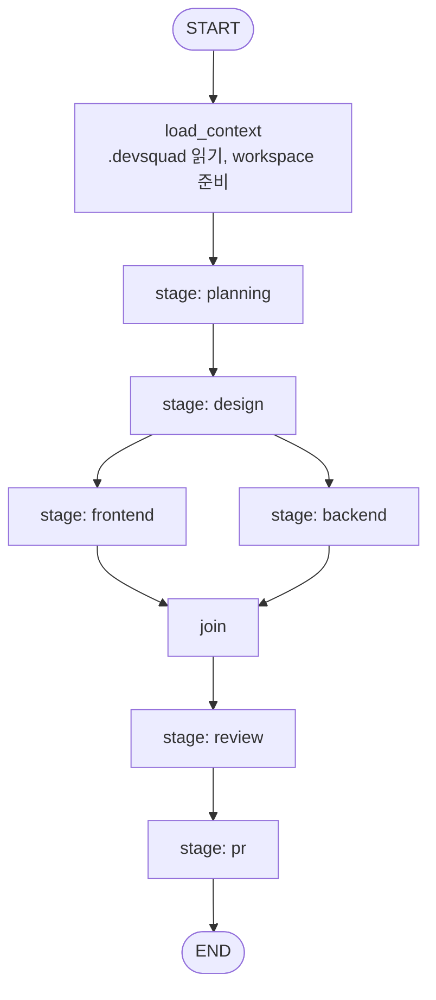
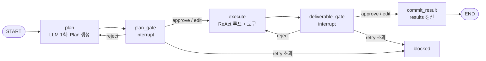

# Backend 설계 — Control Plane + Agent Runtime

> [!tip] 핵심 Takeaway
> Control Plane(Spring)은 **Task·Approval의 상태 기계와 외부 채널 어댑터**에 집중하고, Agent Runtime(Python)은 **`pipeline.yaml`을 읽어 LangGraph 그래프를 동적으로 조립하고 실행**하는 데 집중한다. 승인 게이트는 각 Stage 서브그래프 안의 `plan_gate` / `deliverable_gate` 노드가 `interrupt()`로 구현하며, 재개 시 노드가 처음부터 재실행되는 LangGraph 시맨틱을 감안해 **LLM 호출과 부작용은 gate 노드 밖**에 둔다.

← [[13-Frontend-설계]] · 다음: [[15-API-이벤트-명세]]

---

## Part A. Control Plane (Spring Boot)

### A.1 기술 스택

Java 21, Spring Boot 3.4, Spring Web MVC(REST) + Spring WebSocket(raw, STOMP 미사용), Spring Data JPA + Flyway, PostgreSQL 16, Spring Data Redis(Lettuce) + Redis Stream consumer, JDA 5(Discord), GitHub App은 `hub4j/github-api` + JWT 서명, springdoc-openapi, Spring Security(JWT 리소스 서버), Testcontainers.

### A.2 모듈 구조 (단일 배포, 패키지 by feature)

```
control-plane/
└── src/main/java/dev/devsquad/
    ├── task/            # Task, Stage 도메인 + 상태 기계 + REST
    │   ├── domain/      Task, Stage, TaskStatus, StageStatus, TaskStateMachine
    │   ├── app/         TaskService, TaskQueryService
    │   ├── api/         TaskController, dto/
    │   └── infra/       TaskRepository(JPA)
    ├── approval/        # Approval 도메인 + 멱등 결정 + REST
    │   ├── domain/      Approval, ApprovalKind, Decision
    │   ├── app/         ApprovalService (decide: 트랜잭션 + 낙관적 락 + 채널 동기화 이벤트)
    │   └── api/
    ├── event/           # TaskEvent 저장, Redis Stream consumer, WebSocket 팬아웃
    │   ├── domain/      TaskEvent, EventType
    │   ├── ingest/      RedisStreamConsumer, EventDispatcher
    │   ├── ws/          WsHandler, WsSessionRegistry, SubscriptionManager
    │   └── api/         EventController (replay: after_seq)
    ├── deliverable/     # Deliverable 저장·조회
    ├── runtime/         # Agent Runtime HTTP 클라이언트 + 복구 잡
    │   ├── AgentRuntimeClient (WebClient)
    │   └── RunRecoveryJob (@Scheduled, 기동 시 + 5분 주기)
    ├── discord/         # JDA 어댑터
    │   ├── DiscordGateway (bot 수명)
    │   ├── SlashCommandHandler (/task /status /pause /resume /cancel)
    │   ├── ApprovalCardRenderer (Embed + Buttons)
    │   ├── ButtonInteractionHandler, RejectModalHandler
    │   └── DiscordNotifier (Task thread에 진행 알림)
    ├── github/          # GitHub App 어댑터
    │   ├── GitHubAppAuth (installation token 캐시)
    │   ├── GitHubClient (PR 생성, 파일 커밋, repo 조회)
    │   └── GitHubWebhookController (PR review comment → 알림)
    ├── project/         # Project, agent 파일 편집(GitHub 커밋)
    ├── budget/          # usage 집계, 예산 초과 → pause
    ├── auth/            # JWT, 단일 사용자 (MVP)
    └── common/          # 예외, 응답 포맷, Clock, 이벤트 버스(Spring ApplicationEvent)
```

모듈 간 의존은 도메인 이벤트(`ApprovalDecidedEvent`, `TaskEventIngested`)로 느슨하게 묶는다. 예를 들어 `approval`은 `discord`를 모르고, `discord`가 `ApprovalDecidedEvent`를 구독해 카드를 갱신한다.

### A.3 DB 스키마 (Flyway V1)

```sql
create table project (
  id uuid primary key,
  name text not null,
  github_owner text not null,
  github_repo text not null,
  default_branch text not null default 'main',
  installation_id bigint,
  context_path text not null default '.devsquad',
  token_budget bigint not null default 2000000,
  created_at timestamptz not null default now()
);

create table task (
  id uuid primary key,
  project_id uuid not null references project(id),
  command text not null,
  status text not null,                     -- queued|running|waiting_approval|paused|blocked|completed|failed|cancelled
  discord_thread_id text,
  created_by text not null,
  created_at timestamptz not null default now(),
  updated_at timestamptz not null default now(),
  version int not null default 0            -- optimistic lock
);
create index on task(project_id, status);

create table stage (
  id uuid primary key,
  task_id uuid not null references task(id),
  stage_key text not null,                  -- planning|design|frontend|backend|review|pr
  role text not null,                       -- planner|designer|...
  status text not null,
  retry_count int not null default 0,
  started_at timestamptz, completed_at timestamptz,
  unique(task_id, stage_key)
);

create table approval (
  id uuid primary key,
  task_id uuid not null references task(id),
  stage_id uuid not null references stage(id),
  kind text not null,                       -- plan|deliverable
  retry_no int not null default 0,
  status text not null,                     -- pending|approved|rejected|edited
  title text not null,
  content text not null,                    -- Plan/Deliverable 원문 (승인 시점 스냅샷)
  decision_feedback text,
  edited_content text,
  decided_by text, decided_via text,        -- web|discord
  requested_at timestamptz not null default now(),
  decided_at timestamptz,
  version int not null default 0
);
create index on approval(task_id, status);

create table deliverable (
  id uuid primary key,
  task_id uuid not null references task(id),
  stage_id uuid not null references stage(id),
  kind text not null,                       -- markdown|json|diff|pr
  uri text,                                 -- 외부 저장 시
  content text,                             -- MVP 인라인
  commit_sha text,
  summary text,
  created_at timestamptz not null default now()
);

create table task_event (
  id bigserial primary key,
  event_id uuid not null unique,
  task_id uuid not null references task(id),
  seq bigint not null,
  stage_key text, agent text,
  type text not null,
  payload jsonb not null,
  ts timestamptz not null,
  unique(task_id, seq)
);
create index on task_event(task_id, seq);

create table usage_record (
  id bigserial primary key,
  task_id uuid not null references task(id),
  stage_key text, agent text, model text,
  input_tokens bigint not null, output_tokens bigint not null,
  ts timestamptz not null
);
create index on usage_record(task_id);
```

LangGraph 체크포인트 테이블(`checkpoints`, `checkpoint_writes`, `checkpoint_blobs`)은 Agent Runtime이 `PostgresSaver.setup()`으로 `langgraph` 스키마에 만든다. Control Plane은 이 스키마를 읽지 않는다.

### A.4 핵심 서비스 로직

**TaskService.create** — Task(queued)와 `pipeline.yaml`에서 파생된 Stage 행들을 한 트랜잭션에 저장 → 커밋 후 `AgentRuntimeClient.run()` 호출 → 실패 시 Task를 `failed`로 두고 재시도 잡에 위임. Discord에서 온 경우 thread 생성은 커밋 후 비동기.

**ApprovalService.decide(approvalId, decision, feedback, editedContent, actor, via)** — `select … for update` 없이 JPA `@Version` 낙관적 락으로 `pending → decided` 전이. 이미 결정된 경우 `AlreadyDecidedException`(409). 성공 시 Stage `retry_count` 갱신(reject), Task 상태를 `running`(또는 `blocked`)으로 전이, `ApprovalDecidedEvent` 발행. 트랜잭션 커밋 후 리스너(`@TransactionalEventListener(AFTER_COMMIT)`)가 Agent Runtime `resume`을 호출하고 Discord 카드·WS를 갱신한다. resume 호출이 실패하면 `approval.resume_pending = true`로 표시하고 `RunRecoveryJob`이 재시도한다.

**EventDispatcher** — Redis Stream `devsquad:events`를 consumer group `control-plane`으로 읽고 `event_id` unique로 중복을 걸러 `task_event`에 저장, 타입별 핸들러 분기:
- `approval.requested` → Approval 생성, Task `waiting_approval`, Stage 상태 갱신, Discord 카드, WS
- `deliverable.produced` → Deliverable 저장
- `usage` → usage_record 저장 + 예산 검사(초과 시 `AgentRuntimeClient.cancel` + Task `paused`)
- `stage.*`, `run.*` → Stage/Task 상태 전이
- 나머지 → 저장 + WS만
처리 후 `XACK`. 핸들러 예외는 로그 + dead-letter stream으로 이동.

**RunRecoveryJob** — 기동 시와 5분마다 `running`·`waiting_approval` Task를 훑어 Agent Runtime `state`와 대조(아키텍처 §6.2). `resume_pending` Approval 재전송.

### A.5 Discord 어댑터

JDA를 `@Bean`으로 기동하고 slash command를 guild 단위 등록한다. Interaction은 **3초 내 `deferReply()`** 후 비동기 처리. Plan/Deliverable 카드는 Embed(제목, agent, 버전, 본문 첫 1,500자 + "웹에서 전체 보기" 링크)와 세 버튼(`approve:{approvalId}`, `edit:{approvalId}`, `reject:{approvalId}`)으로 구성한다. reject 버튼은 Modal(피드백 텍스트)을 띄운다. edit 버튼은 Discord에서 긴 편집이 어려우므로 웹 링크로 안내한다. 결정 후 카드는 버튼을 비활성화하고 "✅ 승인됨 · Jin Ho · 10:05"를 footer에 쓴다. 다른 채널(웹)에서 결정되면 `ApprovalDecidedEvent` 리스너가 같은 갱신을 수행한다.

### A.6 GitHub 어댑터

GitHub App으로 동작한다. App private key로 JWT를 만들고 installation access token을 55분 캐시한다. 제공 기능은 repo 파일 읽기/쓰기(Agent 설정 화면의 커밋), PR 생성(`publisher` 단계에서 Agent Runtime이 브랜치를 push한 뒤 Control Plane에 `POST /internal/prs` 요청 → PR 생성 → Deliverable(kind=pr) 저장 → Discord 링크), webhook(`pull_request_review_comment`, `pull_request_review`) 수신 → Task 매핑(브랜치명 `devsquad/<task-id>/<role>`) → Discord·WS 알림. webhook은 HMAC 검증 필수.

### A.7 WebSocket

`/ws` 엔드포인트, JWT 쿼리 파라미터 인증. `SubscriptionManager`가 세션별 구독 task_id 집합을 관리하고, `subscribe` 시 `from_seq`가 있으면 `task_event`에서 replay 후 라이브 전환(replay 중 도착한 라이브 이벤트는 버퍼링 후 seq 순 병합). 다중 인스턴스 시 팬아웃은 Redis Pub/Sub `devsquad:ws:{task_id}`로 브로드캐스트한다(Phase 3).

### A.8 테스트

도메인 상태 기계는 순수 단위 테스트. `ApprovalService.decide` 동시성은 두 스레드가 같은 Approval을 결정하는 통합 테스트로 낙관적 락 검증. Redis Stream consumer와 JPA는 Testcontainers. Discord·GitHub 어댑터는 인터페이스 뒤에 두고 fake로 대체, 실제 API는 계약 테스트 1개씩만.

---

## Part B. Agent Runtime (Python / LangGraph)

### B.1 기술 스택

Python 3.12, FastAPI + uvicorn, LangGraph 1.2 (`langgraph`, `langgraph-checkpoint-postgres`), LangChain Core(모델 추상화, `langchain-anthropic`, `langchain-openai`), Pydantic v2, `redis-py`(Stream 발행), GitPython 또는 subprocess git, pytest + pytest-asyncio.

### B.2 디렉토리 구조

```
agent-runtime/
├── app/
│   ├── main.py                 # FastAPI: /runs, /runs/{id}/resume|continue|cancel|state, /health
│   ├── settings.py             # env: DB URL, Redis, LLM 키, workspace root
│   ├── graph/
│   │   ├── builder.py          # pipeline.yaml → StateGraph 동적 조립
│   │   ├── state.py            # TaskState, StageResult, Approval payload 스키마
│   │   ├── stage_subgraph.py   # 한 Stage의 서브그래프 (plan → gate → execute → gate)
│   │   └── nodes/
│   │       ├── plan.py         # LLM: Plan 생성
│   │       ├── gate.py         # interrupt() 승인 게이트 (plan/deliverable 공용)
│   │       ├── execute.py      # ReAct 에이전트 루프 (도구 사용)
│   │       ├── review.py       # 상호 검수 (FE ↔ BE 계약 대조)
│   │       └── publish.py      # 브랜치 push + Control Plane에 PR 요청
│   ├── agents/
│   │   ├── loader.py           # .devsquad/agents/<role>/ 읽어 AgentSpec 구성
│   │   ├── prompt.py           # System Prompt 조립 (persona + conventions + spec + knowledge + 선행 산출물)
│   │   └── registry.py         # role → 도구 화이트리스트, 모델 설정
│   ├── tools/
│   │   ├── fs.py               # read_file, write_file, list_dir (workspace 샌드박스, .env 등 차단)
│   │   ├── git.py              # checkout_branch, commit, diff, push(승인 후만)
│   │   ├── test_runner.py      # npm test / gradle test (timeout, 출력 truncation)
│   │   ├── search.py           # ripgrep
│   │   └── github.py           # publisher 전용: Control Plane /internal/prs 호출
│   ├── events/
│   │   ├── publisher.py        # Redis Stream XADD, seq 관리
│   │   └── stream_bridge.py    # graph.astream(...) 이벤트 → envelope 변환
│   ├── workspace/
│   │   └── manager.py          # task별 repo clone/worktree, 정리
│   └── runs/
│       └── manager.py          # 실행 중 asyncio task 레지스트리, cancel
├── tests/
└── pyproject.toml
```

### B.3 State 스키마

```python
class StageResult(TypedDict):
    stage_key: str
    role: str
    plan: str | None
    deliverable_ref: str | None       # deliverable_id 또는 uri
    deliverable_summary: str | None
    commit_sha: str | None
    approved: bool

class TaskState(TypedDict):
    task_id: str
    project_ref: ProjectRef           # owner/repo, branch, context_path
    command: str
    pipeline: PipelineSpec            # pipeline.yaml 파싱 결과
    results: Annotated[dict[str, StageResult], merge_by_key]   # reducer: stage_key 기준 병합
    messages_log: Annotated[list[str], add]                    # 사람이 읽는 요약 로그
    usage: Annotated[list[Usage], add]
    error: str | None
```

`results`는 FE·BE가 같은 super-step에서 병렬로 쓰기 때문에 **키 병합 reducer**가 필수다. 기본 덮어쓰기면 한쪽 결과가 사라진다.

### B.4 그래프 조립



`builder.build(pipeline)`은 `depends_on`으로 위상 정렬하고, 각 Stage를 **서브그래프 노드**로 추가하며, 의존 관계를 normal edge로 연결한다. 의존이 같은 Stage들은 자동으로 같은 super-step에 놓여 병렬 실행된다. 여러 Stage가 합류하는 지점은 LangGraph가 팬인을 처리하므로 별도 join 노드는 필요 없지만, 명시성을 위해 no-op `join` 노드를 두어도 된다.

### B.5 Stage 서브그래프



**`plan` 노드** — `prompt.build(role, stage, state)`로 System Prompt를 조립하고 LLM을 한 번 호출해 Plan(Markdown, 번호 목록 + 예상 산출물 + 필요한 도구)을 만든다. 결과를 `approval.requested` 페이로드에 실을 수 있게 서브그래프 private state에 저장한다.

**`gate` 노드 (plan/deliverable 공용)** —

```python
def make_gate(kind: Literal["plan", "deliverable"], max_retries: int):
    def gate(state: StageState) -> Command:
        content = state["plan"] if kind == "plan" else state["deliverable_summary"]
        decision = interrupt({
            "kind": kind,
            "stage_key": state["stage_key"],
            "role": state["role"],
            "retry_no": state["retry_no"],
            "title": f"{state['role']} {kind} v{state['retry_no']+1}",
            "content": content,
            "deliverable_ref": state.get("deliverable_ref"),
        })
        # decision = {"decision": "approve"|"reject"|"edit", "feedback"?, "edited_content"?}
        if decision["decision"] == "reject":
            if state["retry_no"] + 1 >= max_retries:
                return Command(goto="blocked", update={"last_feedback": decision["feedback"]})
            return Command(goto="plan" if kind == "plan" else "execute",
                           update={"retry_no": state["retry_no"] + 1,
                                   "last_feedback": decision["feedback"]})
        update = {}
        if decision["decision"] == "edit":
            update["plan" if kind == "plan" else "deliverable_summary"] = decision["edited_content"]
        return Command(goto="execute" if kind == "plan" else "commit_result", update=update)
    return gate
```

gate 노드는 **LLM도 도구도 호출하지 않는다.** 재개 시 노드가 처음부터 재실행되어도 `interrupt()`까지 부작용이 없으므로 멱등성이 보장된다. `interrupt()`의 payload는 그대로 `approval.requested` 이벤트로 변환된다(`stream_bridge`가 `__interrupt__`를 감지).

**`execute` 노드** — 역할별 도구 화이트리스트를 바인딩한 ReAct 루프(LangGraph prebuilt `create_react_agent`를 서브그래프로 쓰거나 직접 구현). 입력은 승인된 Plan + `last_feedback`(있으면) + 선행 Stage의 승인된 Deliverable. 종료 시 산출물을 만들고(`fs.write_file` → 문서, 또는 `git.commit` → 코드) Deliverable 요약을 `deliverable.produced` 이벤트로 발행한 뒤 private state에 `deliverable_ref`, `deliverable_summary`, `commit_sha`를 기록한다. `max_iterations`(기본 40)와 토큰 한도를 넘으면 현재까지의 결과로 Deliverable을 만들고 `agent.message`로 "한도 도달"을 남긴다. **push는 여기서 하지 않는다.**

**`commit_result` 노드** — 부모 `results[stage_key]`에 `StageResult(approved=True)`를 기록한다. 코드 Stage(FE/BE)는 이 시점에 승인된 커밋을 원격 브랜치에 push한다(승인 이후의 부작용). push 실패는 `run.failed`가 아니라 재시도 가능한 오류로 `agent.message`에 남기고 노드를 재실행할 수 있게 한다.

**`review` Stage** — `execute`가 일반 ReAct 대신 검수 전용 프롬프트를 쓴다. 입력은 FE·BE의 `commit_sha`와 BE가 산출한 API 명세(`docs/api/*.md` 또는 OpenAPI). FE 코드의 API 호출(경로·메서드·요청/응답 타입)을 추출해 BE 명세와 대조하고, 불일치 목록과 "FE 수정 제안"을 Deliverable로 낸다. 불일치가 있으면 `deliverable_gate`에서 사람이 판단한다(승인 → PR 진행, 반려 → FE Stage를 다시 열도록 부모 그래프에서 `Command(goto="frontend")`; Phase 3에서 구현).

**`pr` Stage(publisher)** — 승인 게이트 없이 `results`를 모아 PR 본문을 만들고 Control Plane `POST /internal/prs`를 호출한다. 부작용이 있으므로 이 노드도 멱등하게: 먼저 브랜치의 기존 PR을 조회하고 있으면 재사용.

### B.6 System Prompt 조립

```
[persona.md]                                   ← role / goal / backstory
[conventions.md]                               ← 행동 규칙 (CLAUDE.md 상당)
[공통 spec.md]
[이 Stage의 임무]                              ← stage_key별 고정 지시 (Plan 형식, Deliverable 형식)
[선행 Stage 승인 산출물]                        ← 승인된 것만, 원문 (길면 knowledge로 강등 + 요약)
[knowledge/ 검색 결과]                          ← MVP: 파일 전부 삽입(합계 30k 토큰 이하) / 초과 시 임베딩 검색
[반려 피드백]                                   ← last_feedback 있으면 최상단 근처에 강조
[도구 사용 규칙]                                ← 화이트리스트, 금지 경로
```

토큰 예산은 역할별로 System 40%, 대화 60%를 기준으로 하고, 초과 시 knowledge → 선행 산출물 순으로 요약한다.

### B.7 도구 샌드박스

모든 파일 도구는 `workspace/<task_id>/` 아래로 경로를 정규화하고 상위 탈출을 차단한다. `.env*`, `*.pem`, `*.key`, `secrets/`, `.git/config`는 읽기·쓰기 모두 거부한다. `test_runner`는 `timeout=600s`, 출력 20KB truncation, 네트워크 차단 옵션(가능하면 컨테이너 내 실행). `git.push`는 `commit_result`에서만 호출되도록 `execute`의 화이트리스트에서 제외한다. 역할별 화이트리스트:

| role | tools |
|---|---|
| planner | read_file(docs, src 읽기 전용), write_file(`docs/spec/**`만), search |
| designer | read_file, write_file(`docs/design/**`만), search |
| frontend | read_file, write_file(`web/**`, `docs/api-usage.md`), search, git.commit, test_runner(npm) |
| backend | read_file, write_file(`server/**`, `docs/api/**`), search, git.commit, test_runner(gradle) |
| reviewer | read_file, search, git.diff |
| publisher | github.create_pr |

### B.8 이벤트 브리지

`graph.astream(input, config, stream_mode=["updates", "custom", "messages"], subgraphs=True)`를 소비한다. `updates`에서 노드 시작·종료를 `stage.*`/`agent.*`로 변환하고, `messages`에서 LLM 출력 청크를 모아 문장 단위로 `agent.thinking` 요약(토큰 원문은 보내지 않음), 노드 안에서 `get_stream_writer()`로 쓴 `custom` 이벤트(`tool_call`, `tool_result`, `deliverable.produced`, `usage`)를 그대로 전달, `__interrupt__`를 `approval.requested`로 변환한다. `seq`는 task별 Redis `INCR`로 발급한다.

### B.9 실행 관리와 복구

`runs/manager.py`가 `task_id → asyncio.Task` 레지스트리를 갖는다. `POST /runs`는 레지스트리에 등록 후 즉시 202. `resume`은 `graph.ainvoke(Command(resume=decision), config)`를 새 asyncio task로 띄운다. `cancel`은 asyncio task 취소 + 체크포인트에 `cancelled` 마킹. `continue`는 `graph.ainvoke(None, config)`. `state`는 `graph.aget_state(config)`를 직렬화(`next`, `interrupts`, `values` 요약).

프로세스 재시작 시 실행 중이던 asyncio task는 사라지지만 체크포인트는 남아 있다. Control Plane의 `RunRecoveryJob`이 `continue`를 호출하면 마지막 super-step 다음부터 이어 간다. `execute` 노드 중간에 죽었으면 그 노드는 처음부터 재실행된다(노드 내부 도구 호출은 workspace 파일 상태에 의존하므로 `execute` 시작 시 `git checkout .`으로 작업 트리를 마지막 커밋으로 되돌려 결정성을 확보한다).

### B.10 테스트

`builder`는 `pipeline.yaml` 예시들에 대해 노드·엣지 집합을 스냅샷 테스트. `gate`는 `InMemorySaver`로 interrupt → resume(approve/reject/edit) 세 경로와 retry 초과 경로를 검증. `execute`는 LLM을 fake로 바꿔 도구 화이트리스트 위반 시 거부되는지 확인. 전체 파이프라인은 planning만 있는 pipeline으로 E2E(fake LLM) 한 경로.

---

## Part C. 서버 간 계약 요약

| 방향 | 채널 | 내용 |
|---|---|---|
| CP → AR | HTTP | `POST /runs`, `POST /runs/{id}/resume`, `POST /runs/{id}/continue`, `POST /runs/{id}/cancel`, `GET /runs/{id}/state` |
| AR → CP | Redis Stream `devsquad:events` | 이벤트 envelope (11-아키텍처 §3.2) |
| AR → CP | HTTP | `POST /internal/prs` (publisher), `GET /internal/projects/{id}/context`(선택: `.devsquad` 캐시) |
| 공유 | PostgreSQL | CP: `public` 스키마, AR: `langgraph` 스키마. 서로 읽지 않음 |

내부 HTTP는 mTLS 또는 공유 secret 헤더(`X-Internal-Token`)로 보호한다.
