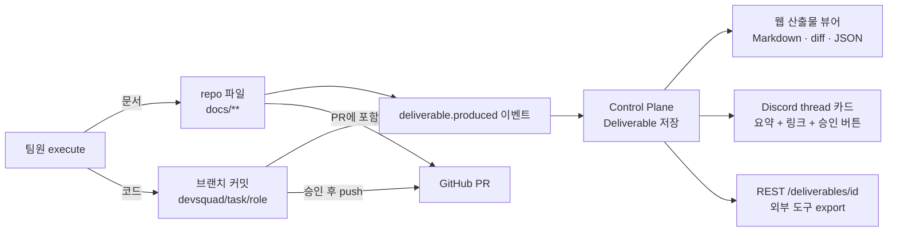

# Agent 정의 가이드 — 사용자가 팀원을 만들고 지식을 주입하는 방법

> [!tip] 핵심 Takeaway
> DevSquad의 팀원은 **고정된 네 명이 아니다.** 사용자가 `.devsquad/agents/<이름>/` 폴더 하나를 만들면 그것이 팀원 한 명이고, `pipeline.yaml`에 이름을 적으면 파이프라인에 합류한다. 서비스가 제공하는 것은 "팀원을 만드는 규격"과 "바로 복사해 쓰는 예시 팀원(템플릿)"이다. 팀원 한 명은 세 파일로 완성된다: **누구인가(`persona.md`)**, **어떻게 일하는가(`conventions.md`)**, **무엇을 알고 있는가(`knowledge/`)**. 그리고 결과물을 **어떤 형식으로 어디에 남기는가**를 `conventions.md`에 반드시 적어야 다음 팀원이 그것을 읽을 수 있다.

← [[16-구현-로드맵]] · 예시 파일: `examples/devsquad-templates/` (이 문서와 함께 배포)

## 1. 사용자 정의 팀원 모델

### 1.1 기본 생각

사람 팀에 새 동료를 뽑을 때 우리는 (1) 직무 기술서를 쓰고, (2) 팀의 작업 규칙과 문서 위치를 알려 주고, (3) 온보딩 자료를 건넨다. 그 뒤로는 업무를 배정하고 결과를 리뷰한다. DevSquad의 팀원도 정확히 이 셋으로 정의된다.

| 사람 팀 | DevSquad | 파일 |
|---|---|---|
| 직무 기술서 (누구, 무엇을 목표로, 어떤 배경) | 페르소나 | `persona.md` |
| 팀 규칙 (컨벤션, 산출물 형식, 문서 위치, 금지 사항) | 행동 규약 | `conventions.md` |
| 온보딩 자료 (기존 문서, 스키마, 가이드) | 도메인 지식 | `knowledge/` |
| 조직도 (누가 누구 다음에, 누구와 병렬로) | 파이프라인 | `pipeline.yaml` |

사용자는 이 파일들을 **자기 저장소 안에** 둔다. 서비스가 관리하는 DB가 아니라 사용자의 repo에 있기 때문에 코드와 같은 PR로 리뷰되고, 프로젝트마다 다르게 둘 수 있고, 서비스를 떠나도 남는다.

### 1.2 서비스가 제공하는 것

서비스는 팀원의 내용을 강제하지 않는다. 대신 다음을 제공한다.

- **규격**: 세 파일의 구조와 필수 항목 (이 문서 §2).
- **템플릿 라이브러리**: 흔한 역할의 완성된 예시 팀원. MVP는 `planner`, `designer`, `frontend`, `backend`, `reviewer` 다섯 개와, "새 역할을 추가하는 법"을 보여 주는 `qa` 한 개.
- **부트스트랩**: `POST /projects/{id}/bootstrap`이 선택한 템플릿을 사용자의 repo `.devsquad/`에 커밋한다. 웹 Agent 설정 화면의 "팀원 추가"가 이것을 부른다.
- **검증**: `pipeline.yaml`이 가리키는 팀원 폴더가 존재하고 필수 파일이 있는지, 산출물 경로가 서로 충돌하지 않는지 Task 생성 시 검사한다.
- **편집 UI**: 웹에서 세 파일을 편집·커밋한다. 파일이 곧 진실이므로 UI는 편의 장치다.

### 1.3 역할 이름과 도구 프로필의 분리

팀원의 **이름**(폴더명, `pipeline.yaml`의 `agent`)은 사용자가 자유롭게 짓는다(`planner`, `기획자`, `pm-kim` 모두 가능). 반면 **도구 프로필**은 서비스가 정의한 소수의 집합에서 고른다. 이름과 도구를 분리해야 "기획자를 두 명 두되 한 명은 도메인 리서치 전용" 같은 구성이 가능하고, 사용자가 이름을 바꿔도 보안 경계가 흔들리지 않는다.

`persona.md` 프론트매터의 `tool_profile`로 지정한다.

| tool_profile | 읽기 | 쓰기 | 실행 | 용도 |
|---|---|---|---|---|
| `docs-writer` | 저장소 전체 | `write_paths`에 명시한 경로만 (기본 `docs/**`) | 없음 | 기획, 디자인, 문서화 역할 |
| `code-writer` | 저장소 전체 | `write_paths` (예: `web/**`) | `test_runner`(명시한 명령), `git.commit` | FE, BE, 인프라 코드 역할 |
| `reader` | 저장소 전체 | 없음 | `git.diff` | 리뷰, 검수, 감사 역할 |
| `publisher` | 저장소 전체 | 없음 | `github.create_pr` | PR 생성 전용. 보통 서비스 내장 팀원 |

모든 프로필은 `.env*`, `*.pem`, `*.key`, `secrets/**`를 읽지도 쓰지도 못한다(14-Backend B.7).

## 2. 팀원 정의 파일 규격

### 2.1 폴더 구조

```
.devsquad/
├── spec.md                    # 프로젝트 공통 컨텍스트 (모든 팀원 주입)
├── pipeline.yaml              # 조직도
└── agents/
    └── <agent-name>/
        ├── persona.md         # 필수
        ├── conventions.md     # 필수
        └── knowledge/         # 선택. 파일이 있으면 자동 주입
            ├── README.md      # 권장: 각 파일이 무엇이고 언제 참고할지
            └── ...
```

### 2.2 `persona.md` — 누구인가

YAML 프론트매터(기계가 읽음) + 본문(LLM이 읽음).

```markdown
---
name: planner                     # 폴더명과 동일. pipeline.yaml에서 참조
display_name: 기획자               # UI·Discord에 표시
tool_profile: docs-writer         # §1.3
write_paths: ["docs/spec/**"]     # tool_profile이 쓰기를 허용할 경로
model: anthropic/claude-sonnet-4-5   # 선택. 없으면 pipeline/project 기본값
color: "#8B7CF6"                  # 선택. UI 아바타 색
---

# 역할 (Role)
한 문장. 이 팀원이 팀에서 맡는 자리.

# 목표 (Goal)
이 팀원이 매 결정에서 최적화하는 것. 2~4문장. "무엇을 잘 하려 하는가"와
"무엇을 피하려 하는가"를 함께 적는다.

# 배경 (Backstory)
전문 분야, 일하는 스타일, 강조하는 가치. 4~8문장. 여기에 적힌 성향이
Plan의 세밀도, 질문하는 습관, 결과물의 톤을 결정한다.

# 판단 기준 (Decision principles)
- 서로 충돌하는 요구가 있을 때 무엇을 우선하는지 3~5개.
```

프론트매터 `name`, `tool_profile`은 필수. 본문의 네 섹션 제목은 고정이다(프롬프트 조립기가 섹션을 찾는다).

### 2.3 `conventions.md` — 어떻게 일하는가

이 파일이 팀원 품질의 8할을 결정한다. 사람 팀의 CLAUDE.md에 해당하며, 다음 여섯 섹션을 **모두** 갖는다.

```markdown
# 1. 입력 (Inputs)
이 팀원이 Stage 시작 시 읽어야 하는 것. 선행 팀원의 산출물 경로,
spec.md의 어느 절, knowledge/의 어느 파일. "읽지 않아도 되는 것"도 적는다.

# 2. Plan 형식 (Plan format)
승인 게이트에 올릴 계획의 고정 형식. 번호 목록 + 각 항목의 산출물 파일
경로 + 예상 소요(도구 호출 수 기준). 사람이 30초 안에 읽고 결정할 수 있어야 한다.

# 3. 작업 규칙 (Working rules)
해야 할 것 / 하지 말아야 할 것. 코딩 컨벤션, 문서 스타일, 라이브러리 제한,
테스트 의무, 파일 명명, 커밋 메시지 형식.

# 4. 결과물 형식 (Deliverable format)  ★ 다음 팀원이 읽는다
파일 경로 패턴, 파일 구조(섹션 제목 고정), 기계 판독 블록(JSON/YAML)이
필요하면 그 스키마. 여러 파일이면 index 파일 지정.

# 5. 완료 기준 (Definition of done)
스스로 "끝났다"고 판단하는 체크리스트. 승인 요청 전 자가 점검.

# 6. 금지 사항 (Never)
절대 하지 않을 것. 보안, 범위 밖 작업, 추측으로 채우기 등.
```

### 2.4 `knowledge/` — 무엇을 알고 있는가

파일을 넣으면 프롬프트에 주입된다. 주입 방식은 총량으로 결정한다. 합계 30k 토큰 이하면 전부 그대로 삽입하고, 초과하면 `README.md`의 설명을 인덱스로 삼아 Stage 임무와 관련 높은 파일만 골라 넣는다(Phase 2: 임베딩 검색). 따라서 `README.md`에 각 파일이 "무엇이고 언제 봐야 하는지"를 한 줄씩 적어 두는 것이 중요하다.

무엇을 넣어야 하는가에 대한 원칙은 "**LLM이 모르는 것, 이 프로젝트에만 있는 것**"이다. 일반 지식(REST란 무엇인가)은 넣지 않고, 우리 DB 스키마·우리 API 규칙·우리 디자인 토큰·과거 결정 기록 같은 것을 넣는다.

### 2.5 `spec.md` — 공통 컨텍스트

모든 팀원에게 주입되는 프로젝트 소개. 제품이 무엇인지, 사용자가 누구인지, 기술 스택, 저장소 구조, 핵심 도메인 용어집. 2~3페이지를 넘지 않게 유지하고 상세는 `knowledge/`로 내린다.

## 3. 프롬프트 조립 규칙 (Agent Runtime이 하는 일)

사용자가 위 파일들을 쓰면 Agent Runtime의 `prompt.build`가 Stage마다 다음 순서로 System Prompt를 만든다. 순서와 구분자는 고정이라 사용자가 알고 있으면 파일을 더 잘 쓸 수 있다.

```
<persona>            persona.md 본문 (프론트매터 제외)
<conventions>        conventions.md 전체
<project>            .devsquad/spec.md
<mission>            서비스 고정 지시: 지금이 plan 단계인지 execute 단계인지,
                     Plan/Deliverable을 어떤 이벤트로 제출하는지, 도구 사용 규칙
<inputs>             conventions §1이 가리키는 선행 산출물 원문 (승인된 것만)
<knowledge>          knowledge/ 파일들 (§2.4 규칙으로 선택)
<feedback>           반려 피드백이 있으면 여기. "이전 제출은 다음 이유로 반려됨" + 원문
<tools>              tool_profile에 따른 도구 목록과 write_paths
```

`<mission>`은 사용자가 건드리지 않는다. plan 단계 mission은 "conventions §2 형식으로 Plan만 작성하고 도구를 쓰지 말 것", execute 단계 mission은 "승인된 Plan을 수행하고 conventions §4 형식으로 결과물을 남긴 뒤 §5로 자가 점검할 것"이다. 이 분리 덕분에 사용자는 "무엇을"만 쓰고 "언제 어떻게 제출하는지"는 서비스가 책임진다.

## 4. 결과물 공유 — 각 팀원의 산출물이 사용자에게 닿는 경로

팀원의 결과물은 하나의 사실(파일 또는 커밋)에서 출발해 네 경로로 사용자에게 전달된다.



역할별로 무엇이 어디에 남는지는 `conventions.md` §4가 정한다. 템플릿의 기본값은 다음과 같다.

| 팀원 | 결과물 | 저장소 위치 | 웹 뷰어 | Discord 카드 | 다음 팀원이 읽는 방법 |
|---|---|---|---|---|---|
| planner | 요구사항 정의서 + 유스케이스 + 화면 목록 | `docs/spec/<task-slug>.md` | Markdown | 요약 + 링크 | designer·backend가 `<inputs>`로 원문 수신 |
| designer | 화면 설계서 + 컴포넌트 트리 JSON | `docs/design/<task-slug>.md`, `docs/design/<task-slug>.components.json` | Markdown + JSON 트리 | 요약 + 링크 | frontend가 JSON을 컴포넌트 골격으로 사용 |
| backend | API 명세 + 코드 커밋 | `docs/api/<task-slug>.md`(OpenAPI 조각 포함), `server/**` 커밋 | diff + Markdown | 변경 파일 수·테스트 결과 요약 | frontend·reviewer가 API 명세를 계약으로 사용 |
| frontend | 코드 커밋 + API 사용 기록 | `web/**` 커밋, `docs/api-usage/<task-slug>.md` | diff + Markdown | 변경 파일 수·테스트 결과 요약 | reviewer가 api-usage와 API 명세를 대조 |
| reviewer | 검수 리포트 (불일치 목록, 심각도, 수정 제안) | `docs/review/<task-slug>.md` | Markdown | 불일치 건수 + 링크 | publisher가 PR 본문에 포함 |
| publisher | PR | GitHub PR | PR 링크 | PR 링크 | — |

사용자 입장에서 정리하면, **읽고 결정할 때는 웹(원문)**, **알림과 빠른 승인은 Discord(요약)**, **보관과 리뷰는 GitHub(파일·PR)** 이다. 결과물이 서비스 DB에만 있는 경우는 없다. 서비스가 사라져도 `docs/`와 브랜치는 사용자의 repo에 남는다.

## 5. 새 팀원을 추가하는 절차 (사용자 관점)

1. 웹 Agent 설정 → "팀원 추가" → 템플릿 선택(또는 "빈 팀원") → 이름 지정. 서비스가 `.devsquad/agents/<이름>/`을 커밋한다.
2. `persona.md`의 역할·목표·배경을 자기 프로젝트에 맞게 고친다. `tool_profile`과 `write_paths`를 정한다.
3. `conventions.md` §1(입력)과 §4(결과물 형식)를 먼저 확정한다. 이 둘이 앞뒤 팀원과의 계약이다. 나머지 절은 그다음.
4. `knowledge/`에 이 팀원만 알아야 할 자료를 넣고 `README.md`에 한 줄씩 설명한다.
5. `pipeline.yaml`에 Stage를 추가한다. `depends_on`으로 자리를 정하고 `approvals`를 고른다.
6. 웹에서 "이 팀원으로 테스트 실행"(Phase 3) 또는 작은 Task로 시험한다. Plan이 §2 형식대로 나오는지, 결과물이 §4 경로에 생기는지 확인한다.

## 6. 좋은 팀원 정의의 원칙

**구체적인 결과물 형식이 추상적인 성격 묘사보다 백 배 중요하다.** "꼼꼼한 기획자"라는 문장은 결과를 거의 바꾸지 못하지만, "유스케이스는 `UC-<번호>: <제목>` 헤더 아래 사전조건·주 흐름·대안 흐름·사후조건 네 절을 갖는다"는 문장은 결과를 확실히 바꾼다.

**입력을 명시하면 환각이 줄어든다.** conventions §1에 "선행 산출물에 없는 요구사항은 만들어 내지 말고 `[확인 필요]`로 표시한다"를 넣는 것이 어떤 성격 묘사보다 효과적이다.

**Plan은 짧게, 결과물은 형식대로.** Plan이 길면 승인자가 읽지 않는다. 항목 3~7개, 각 항목에 산출물 경로 하나.

**금지 사항은 도구 프로필로 강제하고 conventions에는 이유를 적는다.** "`.env`를 읽지 마라"는 도구 계층이 막는다. conventions에는 "왜 이 팀원은 `server/`를 건드리지 않는가"를 적어 LLM이 경계를 이해하게 한다.

**반려 피드백을 다음 제출에 어떻게 반영했는지 밝히게 한다.** conventions §5(완료 기준)에 "재제출 시 결과물 상단에 '반려 반영 내역' 절을 둔다"를 넣으면 승인자가 무엇이 바뀌었는지 바로 본다.

**팀원 수는 적게 시작한다.** 팀원이 늘면 승인 게이트도 늘어난다. 한 팀원이 두 역할을 겸할 수 있으면 그렇게 하고, 병목이 보일 때 나눈다.

## 7. 템플릿 라이브러리

이 문서와 함께 `examples/devsquad-templates/`에 완성된 예시 팀원 여섯 개와 `spec.md`, `pipeline.yaml` 예시가 있다. 대상 스택은 Spring Boot(server/) + Next.js(web/) 모노레포를 가정했으며, 다른 스택이면 `conventions.md` §3과 `write_paths`, `test_runner` 명령만 바꾸면 된다.

| 템플릿 | tool_profile | 한 줄 소개 |
|---|---|---|
| `planner` | docs-writer | 요구사항을 유스케이스·화면 목록·비기능 요구로 구조화하는 기획자 |
| `designer` | docs-writer | 화면 설계서와 컴포넌트 트리 JSON을 내는 UX 디자이너 |
| `backend` | code-writer | API 명세를 먼저 쓰고 Spring 코드와 테스트를 구현하는 백엔드 개발자 |
| `frontend` | code-writer | 컴포넌트 트리와 API 명세로 Next.js 화면을 구현하는 프론트엔드 개발자 |
| `reviewer` | reader | FE의 API 사용과 BE 명세를 대조해 불일치를 찾는 검수자 |
| `qa` (확장 예시) | code-writer | 승인된 유스케이스로 E2E 시나리오를 작성하는 QA — "새 역할 추가" 시연용 |

각 템플릿의 파일은 그대로 복사해 쓸 수 있는 상태로 작성되어 있으며, 본 문서 §2의 규격을 따른다.
